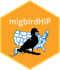
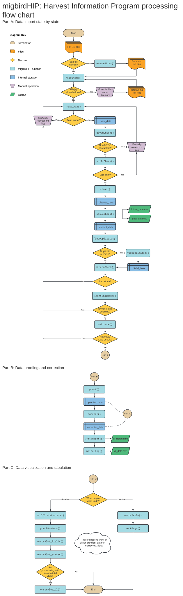

<!-- README.md is generated from README.Rmd. Please edit that file -->

```{r, include = FALSE}
knitr::opts_chunk$set(
  collapse = TRUE,
  comment = "#>",
  fig.path = "man/figures/README-",
  out.width = "100%"
)
```

# migbirdHIP 

## Overview

The migbirdHIP package provides a set of R functions for the U.S. Fish and Wildlife Service Migratory Bird Program to process, clean, and visualize [Harvest Information Program](https://www.fws.gov/harvestsurvey) data.

Tasks that can be accomplished with this package include:

* `read_hip` imports data
* `clean` does basic reorganization tasks
* `fileCheck` makes sure all files are new
* `glyphCheck` identifies non-UTF-8 characters
* `shiftCheck` finds line shift errors
* `strataCheck` identifies any new or unexpected strata
* `issueCheck` looks for records that should be processed later
* `duplicateFinder` identifies duplicate HIP records
* `duplicateFix` resolves duplicate HIP records
* `proof` checks values for errors
* `correct` systematically fixes erroneous values
* Error visualization with `errorPlotDL`, `errorPlotFields`, and `errorPlotStates`
* Detailed error table reporting with `errorTable` and `pullErrors`
* Automated report writing with `writeReport` 
* Custom .csv writing with `write_hip`

## Installation

```r 
devtools::install_github("USFWS/migbirdHIP", build_vignettes = T)
```

## Releases

Below are the definitive package versions used for each hunting season. To install a past release, use the example below and substitute the appropriate version number.

```r 
devtools::install_github("USFWS/migbirdHIP@v1.2.8", build_vignettes = T)
```

* dev - 2025-2026
* [v1.3.0](https://github.com/USFWS/migbirdHIP/releases/tag/v1.3.0) - 2024-2025
* [v1.2.8](https://github.com/USFWS/migbirdHIP/releases/tag/v1.2.8) - 2023-2024
* [v1.2.7](https://github.com/USFWS/migbirdHIP/releases/tag/v1.2.7) - 2022-2023
* [v1.2.4](https://github.com/USFWS/migbirdHIP/releases/tag/v1.2.4) - 2021-2022 


## Vignette

```r
vignette(topic = "migbirdHIP_workflow", package = "migbirdHIP")
```

## Function Flow



## USFWS Disclaimer

The United States Fish and Wildlife Service (FWS) GitHub project code is provided on an “as is” basis and the user assumes responsibility for its use. FWS has relinquished control of the information and no longer has responsibility to protect the integrity, confidentiality, or availability of the information. Any reference to specific commercial products, processes, or services by service mark, trademark, manufacturer, or otherwise, does not constitute or imply their endorsement, recommendation or favoring by FWS. The FWS seal and logo shall not be used in any manner to imply endorsement of any commercial product or activity by FWS or the United States Government.

## License

This project is licensed under the terms of the [Creative Commons Zero v1.0 Universal](https://creativecommons.org/publicdomain/zero/1.0/) license.
