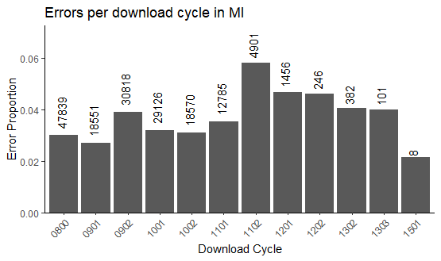

# The migbirdHIP Workflow

## Table of Contents

- [Introduction](#introduction)
  - [Installation](#installation)
    - [Releases](#releases)
  - [Load](#load)
  - [Functions overview](#functions-overview)
- [Part A: Data Import and Cleaning](#part-a-data-import-and-cleaning)
  - [fileRename](#filerename)
  - [fileCheck](#filecheck)
  - [read_hip](#read_hip)
  - [qualityMessages](#qualitymessages)
  - [glyphCheck](#glyphcheck)
  - [shiftCheck](#shiftcheck)
  - [clean](#clean)
  - [issueCheck](#issuecheck)
  - [duplicateFinder](#duplicatefinder)
  - [duplicateFix](#duplicatefix)
  - [bagCheck](#bagcheck)
  - [proof](#proof)
  - [correct](#correct)
- [Part B: Data Visualization and
  Tabulation](#part-b-data-visualization-and-tabulation)
  - Visualization
    - [duplicatePlot](#duplicateplot)
    - [errorPlotFields](#errorplotfields)
    - [errorPlotStates](#errorplotstates)
    - [errorPlotDL](#errorplotdl)
  - Tabulation
    - [pullErrors](#pullerrors)
    - [errorTable](#errortable)
- [Part C: Writing Data and Reports](#part-c-writing-data-and-reports)
  - [write_hip](#write_hip)
  - [writeReport](#writereport)

## Introduction

The `migbirdHIP` package was created by the U.S. Fish and Wildlife
Service (USFWS) to process, clean, and visualize Harvest Information
Program (HIP) registration data.

### Installation

The package can be installed from the USFWS GitHub repository using:

``` r

pak::pak("USFWS/migbirdHIP")
```

#### Releases

To install a past release, use the example below and substitute the
appropriate version number. Releases are documented in the
[README](https://github.com/USFWS/migbirdHIP/blob/main/README.md#releases).

``` r

pak::pak("USFWS/migbirdHIP@v2026.0.0")
```

### Load

Load `migbirdHIP` after installation. The package will return a startup
message with the version you have installed and what season of HIP data
the package version was intended for.

``` r

library(migbirdHIP)
```

    ## migbirdHIP v2026.0.0
    ## Compatible with 2026-2027 HIP data

### Functions overview

The flowchart below is a visual guide to the order in which functions
are used. Some functions are only used situationally and some issues
with the data cannot be solved using a function at all. The general
process of handling HIP data is demonstrated in the flowchart; every
exported function in the `migbirdHIP` package is included in it and the
vignette.


Overview of migbirdHIP functions in a flowchart format.

## Part A: Data Import and Cleaning

### fileRename

The
[`fileRename()`](https://usfws.github.io/migbirdHIP/reference/fileRename.md)
function renames non-standard file names to the standard format. We
expect a file name to be a 2-letter capitalized state abbreviation
followed by YYYYMMDD (indicating the date data were submitted).

Some states submit files using a 5-digit file name format, containing 2
letters for the state abbreviation followed by a 3-digit Julian date. To
convert these 5-digit filenames to the standard format (a requirement to
read data properly with [read_hip()](#read_hip)), supply
[`fileRename()`](https://usfws.github.io/migbirdHIP/reference/fileRename.md)
with the directory containing HIP data. File names will be automatically
overwritten with the YYYYMMDD format date corresponding to the submitted
Julian date.

This function also converts lowercase state abbreviations to uppercase.

The current hunting season year must be supplied to the `year` parameter
to accurately convert dates.

``` r

fileRename(path = "C:/HIP/raw_data/DL0901", year = 2026)
```

### fileCheck

Check if any files in the input folder have already been written to the
processed folder using
[`fileCheck()`](https://usfws.github.io/migbirdHIP/reference/fileCheck.md).

``` r

fileCheck(
  raw_path = "C:/HIP/raw_data/DL0901/",
  processed_path = "C:/HIP/corrected_data/"
)
```

### read_hip

Read HIP data from fixed-width `.txt` files using
[`read_hip()`](https://usfws.github.io/migbirdHIP/reference/read_hip.md).
Files must adhere to a 10-character naming convention to successfully be
read in (2-letter capitalized state abbreviation followed by
`YYYYMMDD`); if files were submitted with a 5-digit format or lowercase
state abbreviation, run [fileRename](#filerename) first.

**Note:** In the
[`read_hip()`](https://usfws.github.io/migbirdHIP/reference/read_hip.md)
example below, we use an internal directory to read in fake HIP data
files, which allows the function to demonstrate its errors and messages.
(The testing data were generated with `data-raw/create_fake_HIP_data.R`
and are stored under `inst/extdata/`.) All other examples in this
vignette will use `C:/` drive examples for clarity.

``` r

raw_data <- read_hip(paste0(here::here(), "/inst/extdata/DL0901/"))
```

    ## Time to read in 49 files: 0 sec

#### The `read_hip()` function allows data to be read in for:

- all states (e.g., `state = NA`, the default)
- a specific state (e.g., `state = "DE"`)
- a specific download (e.g., `season = FALSE`, the default; `path` must
  be to the download’s subdirectory)
- an entire season (e.g., `season = TRUE`, and `path` is to the
  directory containing all download subdirectories)

Use `unique = TRUE` to read in a frame without exact duplicates, or
`unique = FALSE` to read in all registrations including exact
duplicates. **Important:** the `record_key` field is not created if
`unique = FALSE`, which is required in some following steps (e.g.,
[`duplicateFix()`](https://usfws.github.io/migbirdHIP/reference/duplicateFix.md),
[`proof()`](https://usfws.github.io/migbirdHIP/reference/proof.md)).

Data are read in an expected format beginning with the `title` field and
ending with `email` field. Additional fields are created by
[`read_hip()`](https://usfws.github.io/migbirdHIP/reference/read_hip.md):
`dl_state`, `dl_date`, `source_file`, `dl_cycle`, `dl_key`,
`record_key`.

#### The `read_hip()` function does NOT read in data:

- From subfolders named `"hold"`, `"permit"`, or `"lifetime"`.
- Permit and lifetime HIP registrations must be read in and processed in
  a different workflow than the one outlined in this vignette.

#### The `read_hip()` function fails if:

- The state abbreviation in the file name is not found in the list of 49
  continental US states.
- The date in the file name is formatted incorrectly.

#### The `read_hip()` function returns a message if:

- Blank files are found in the directory

As an example, we will use the default
[`read_hip()`](https://usfws.github.io/migbirdHIP/reference/read_hip.md)
settings to read in all of the states from download 0901, using fake HIP
data files located in the `extdata/DL0901/` directory of the R package.

### qualityMessages

#### The `qualityMessages()` function returns a message if:

- `NA` values detected in one or more ID fields (`firstname`,
  `lastname`, `state`, `birth_date`) for \>10% of a file and/or \>100
  registrations
- All emails are missing from a file
- Test records are found
- Any registration has a `0` in every bag field
- Any registration has an `NA` in every bag field
- Any registration contains a bag value that is not a 1-digit number
- For presumed solo permit DNHs; if any OR or WA `hunt_mig_birds` does
  not equal `2` when non-permit bags are `0` and one of
  `band_tailed_pigeon`, `brant`, and/or `seaduck` is `2`.
- Any registration_yr is not equal to `REF_CURRENT_SEASON` or
  `REF_CURRENT_SEASON + 1`

### glyphCheck

During pre-processing, R may throw an error that says something like
“invalid UTF-8 byte sequence detected”. The error usually includes a
field name but no other helpful information. The
[`glyphCheck()`](https://usfws.github.io/migbirdHIP/reference/glyphCheck.md)
function identifies values containing non-UTF-8 glyphs/characters and
prints them with the source file in the console so they can be edited.

``` r

glyphCheck(raw_data)
```

    ## All characters are UTF-8

### shiftCheck

Find and print any rows that have a line shift error with
[`shiftCheck()`](https://usfws.github.io/migbirdHIP/reference/shiftCheck.md).

``` r

shiftCheck(raw_data)
```

    ## No line shifts detected.

### clean

The [`clean()`](https://usfws.github.io/migbirdHIP/reference/clean.md)
function performs data cleaning and filters out bad registrations.

``` r

clean_data <- clean(raw_data)
```

    ## A total of 919 2s converted to 0s for permit file states:

    ## # A tibble: 9 × 3
    ##   dl_state     n spp   
    ##   <chr>    <int> <chr> 
    ## 1 CO         118 cranes
    ## 2 KS         100 cranes
    ## 3 MN         108 cranes
    ## 4 MT         105 cranes
    ## 5 ND          96 cranes
    ## 6 NM         110 cranes
    ## 7 OK         105 cranes
    ## 8 TX         107 cranes
    ## 9 WY          70 cranes

    ## A total of 305 2s converted to 0s for permit file states:

    ## # A tibble: 3 × 3
    ##   dl_state     n spp               
    ##   <chr>    <int> <chr>             
    ## 1 CO         107 band_tailed_pigeon
    ## 2 NM         106 band_tailed_pigeon
    ## 3 UT          92 band_tailed_pigeon

#### Registrations are dropped if:

- Any bag value is not a 1-digit number.
- `NA` or `0` for every bag field
- Test record is detected
  - `firstname` and `lastname` are `"TEST"`
  - `lastname` is `"INAUDIBLE"`
  - `firstname` is one of:
    `"INAUDIBLE", "BLANK", "USER", "TEST", "RESIDENT"`
- One of:
  - `firstname`, `lastname`, `state`, or `birth_date` is `NA`
  - `address` AND `email` are `NA`, `city`
  - AND/OR `zip` AND `email` are `NA`

#### Changes include:

- `firstname`
  - Change to uppercase
  - If a suffix value is detected (e.g. JR, SR, 1ST-20TH and 1-20 in
    Roman numerals, excluding XVIII) delete it. Delete white space
    around string.
- `lastname`
  - Change to uppercase
  - If a suffix value is detected (e.g. JR, SR, 1ST-20TH and 1-20 in
    Roman numerals, excluding XVIII) delete it. Delete white space
    around string.
- `suffix`
  - Change to uppercase
  - If a suffix value is detected in firstname or lastname, replace the
    suffix field with that value. Values that are searched for include
    JR, SR, 1ST-20TH and 1-20 in Roman numerals, excluding XVIII.
    Periods and commas are deleted.
- `zip`
  - Remove ending hyphen from zip codes with only 5 digits
  - Remove ending 0 from zip codes with 10 digits
  - Insert a hyphen in continuous 9 digit zip codes
  - Insert a hyphen in 9 digit zip codes with a middle space
  - Delete trailing -0000 and -\_\_\_\_
- `hunt_mig_birds`
  - For Oregon and/or Washington, if `hunt_mig_birds` is `0` and if
    `band_tailed_pigeon`, `brant`, or `seaduck` is `2`, change
    `hunt_mig_birds` field from `0` to `2`
- `band_tailed_pigeon`
  - If any permit file states submitted a `2` for band_tailed_pigeon,
    change the `2` to a `0`
- `cranes`
  - If any permit file states submitted a `2` for crane, change the `2`
    to a `0`

In addition to the changes listed above, the internal
[`zipCheck()`](https://usfws.github.io/migbirdHIP/reference/zipCheck.md)
function returns a message from
[`clean()`](https://usfws.github.io/migbirdHIP/reference/clean.md) if
zip codes are detected that do not correspond to provided state of
residence for \>10% of a file and/or \>100 registrations.

### issueCheck

The
[`issueCheck()`](https://usfws.github.io/migbirdHIP/reference/issueCheck.md)
function assesses the validity of the `issue_date` field based on the
current hunting season’s HIP issuance start and end dates (not season
open and close dates). A plot is automatically returned for past and
future registrations. The plot is skipped by default, so to plot the
data write `plot = TRUE`.

``` r

current_data <- issueCheck(clean_data, year = 2026, plot = FALSE)
```

#### Criteria evaluated and changes made:

- **Past registration:** a registration’s `issue_date` is before the
  start date of HIP issuance for its state; these registrations are
  filtered out.
- **Overlap registration:** registrations from 2-season states with an
  `issue_date` between the start of next season’s issue start and this
  season’s issue end fall into the `"overlap"` category; these
  registrations are assigned `"current"` if `registration_yr` is equal
  to `year` or `"future"` if `registration_yr` is `year + 1`.
- **Current registration:** a registration’s `issue_date` falls between
  the start and end dates of HIP issuance for its state;
  `registration_yr` is overwritten with `year`.
- **Future registration:** a registration has an `issue_date` after the
  last day of issuance for its state for this season AND the
  `issue_date` falls between the projected issue start and end dates for
  next season; the `registration_yr` is changed to `year + 1`.
- **Invalid registration:** a registration’s `issue_date` does not fall
  in the issue window for this season or next season; the date falls in
  the gap between issue windows. These registrations are filtered out.
- **Bad `issue_date`:** a registration’s `issue_date` cannot be
  evaluated, likely because it’s formatted incorrectly or is illogical;
  these registrations are filtered out.
- Return message if any registration’s `issue_date` is after the file
  was submitted.

### duplicateFinder

The
[`duplicateFinder()`](https://usfws.github.io/migbirdHIP/reference/duplicateFinder.md)
function finds hunters that have more than one registration.
Registrations are grouped by `firstname`, `lastname`, `state`,
`birth_date`, `dl_state`, and `registration_yr` to identify unique
hunters. If the same hunter has 2 or more registrations, the fields that
are not identical are counted and summarized.

Plot the duplicates with [duplicatePlot](#duplicateplot).

``` r

duplicateFinder(current_data)
```

    ## There are 38 registrations with duplicates; 76 total duplicated records.

    ## # A tibble: 2 × 2
    ##   duplicate_field     n
    ##   <chr>           <int>
    ## 1 bag                14
    ## 2 issue_date         24

### duplicateFix

We sometimes receive multiple HIP registrations per person which must be
resolved by
[`duplicateFix()`](https://usfws.github.io/migbirdHIP/reference/duplicateFix.md).
Duplicates are identified when more than one registration has the same
`firstname`, `lastname`, `state`, `birth_date`, `dl_state`, and
`registration_yr`. Only 1 HIP registration per hunter can be kept. For
in-line permit states (WA, OR), permit records are submitted separately
from HIP registrations. Multiple permits are allowed. We differentiate
`HIP` and `PMT` records from in-line permit states, we check the values
in the non-permit species fields (`ducks_bag`, `geese_bag`, `dove_bag`,
`woodcock_bag`, `coots_snipe`, `rails_gallinules`). HIP registrations
contain non-zero values in those columns, but permit records always have
`0` values.

``` r

deduplicated_data <- duplicateFix(current_data)
```

To decide which HIP registration to keep from a group, we follow a
series of logic.

#### For sea duck and brant states:

These states include: AK, CA, CT, DE, MA, MD, NC, NH, NJ, NY, RI, VA

1.  Keep registration(s) with the most recent issue date.
2.  Exclude registrations with all 1s or all 0s in bag columns from
    consideration.
3.  Keep any registrations that have a 2 for either brant or sea duck
    (for seaduck and brant states), or 2 for seaduck (Maine only).
4.  If more than one registration remains, choose to keep one randomly.

#### For HIP registrations from in-line permit states and all other states:

These states include: AL, AZ, AR, CO, FL, GA, ID, IL, IN, IA, KS, KY,
LA, MI, MN, MS, MO, MT, NE, NV, NM, ND, OH, OK, OR, PA, SC, SD, TN, TX,
UT, VT, WA, WV, WI, WY

1.  Keep registration(s) with the most recent issue date.
2.  Exclude registrations with all 1s or all 0s in bag columns from
    consideration, if possible.
3.  If more than one registration remains, choose to keep one randomly.

A new field called `record_type` is added to the data after the above
deduplicating process. Every HIP registration is labeled `HIP`. In-line
permit states WA and OR send HIP and permit records separately, which
are labeled `HIP` and `PMT` respectively.

### bagCheck

Running
[`bagCheck()`](https://usfws.github.io/migbirdHIP/reference/bagCheck.md)
ensures species “bag” values are in order. This function searches for
values in species group columns that are not typical or expected by the
US Fish and Wildlife Service. If a value outside of the normal range is
detected, an output tibble is created. Each row in the output contains
the state, species, unusual stratum value, and a list of the normal
values we would expect.

In-line permit records are not included in this check, to prevent
`ducks_bag = "0"` values from popping up when we know those don’t count.

If a value for a species group is given in the HIP data that doesn’t
match anything in our records, the species reported in the output will
have `NA` values in the `expected_bag_value` column. These species are
not hunted in the reported states.

``` r

bagCheck(deduplicated_data)
```

    ## # A tibble: 84 × 6
    ##    dl_state spp          bad_bag_value expected_bag_value     n proportion
    ##    <chr>    <chr>        <chr>         <chr>              <int> <chr>     
    ##  1 MD       woodcock_bag 9             2, 3, 5                1 0%        
    ##  2 FL       woodcock_bag 9             1, 2, 3, 5             1 0%        
    ##  3 GA       dove_bag     9             1, 2, 3, 5             1 0%        
    ##  4 KS       dove_bag     9             1, 2, 3, 5             1 0%        
    ##  5 KY       dove_bag     9             1, 2, 3, 5             1 0%        
    ##  6 KY       woodcock_bag 9             1, 2, 3, 5             1 0%        
    ##  7 NJ       woodcock_bag 9             1, 2, 3, 5             1 0%        
    ##  8 MT       coots_snipe  9             1, 2, 3, 4, 5          1 0%        
    ##  9 NC       ducks_bag    9             1, 2, 3, 4, 5          1 0%        
    ## 10 NC       dove_bag     9             1, 2, 3, 4, 5          1 0%        
    ## # ℹ 74 more rows

### proof

After data are cleaned and checked in the steps above, we run
[`proof()`](https://usfws.github.io/migbirdHIP/reference/proof.md) to
check for errors. Note that no actual corrections or data changes take
place as a result of this function. The year of the Harvest Information
Program must be supplied to the `year` parameter, which aids in checking
`registration_yr`, `issue_date` and `birth_date`.

Values that are considered irregular are flagged in a new field called
`errors`. For each existing field (title, firstname, middle, lastname,
suffix, address, city, state, zip, birth_date, issue_date,
hunt_mig_birds, ducks_bag, geese_bag, dove_bag, woodcock_bag,
coots_snipe, rails_gallinules, cranes, band_tailed_pigeon, brant,
seaducks, registration_yr, email), values are compared to standard
expected formats. If they do not conform, the field name is pasted as a
string in the `errors` column. Each row can have anywhere from zero
errors (`NA`) to all field names listed. Multiple errors per
registration are hyphen delimited. A typical `errors` value would look
like: `"suffix-address-zip"`, `"zip"`, or `"middle-email"`.

``` r

proofed_data <- proof(deduplicated_data, year = 2026)
```

#### What gets flagged in the `errors` field and why:

- `"title"`
  - If `title` is not one of: `NA`, `0`, `1` or `2`.
  - If common first names are assigned the wrong title.
- `"firstname"`
  - `firstname` contains anything other than letters, apostrophe(s),
    space(s), and/or hyphen(s)
  - `firstname` contains less than 2 letters
  - `firstname` contains `"AKA"`
- `"middle"` if `middle` is not exactly 1 letter or `NA`
- `"lastname"`
  - `lastname` contains anything except letters, apostrophe(s),
    space(s), hyphen(s), and/or period(s)
  - `lastname` contains less than 2 letters
- `"suffix"`
  - `suffix` should be one of:
    `I, II, III, IV, V, VI, VII, VIII, IX, X, XI, XII, XIII, XIV, XV, XVI, XVII, XIX, XX, 1ST, 2ND, 3RD, 4TH, 5TH, 6TH, 7TH, 8TH, 9TH, 10TH, 11TH, 12TH, 13TH, 14TH, 15TH, 16TH, 17TH, 18TH, 19TH, 20TH, JR, SR`.
  - Note that `XVIII` is excluded (exceeds 4 character limit)
- `"address"` if `address` contains a `|`, tab, or non-UTF8 character
- `"city"`
  - `city` contains anything other than letters, space(s), hyphen(s),
    apostrophe(s), and/or period(s)
  - `city` contains less than 3 letters
- `"state"` if `state` is not contained in the following list of
  abbreviations for US states and territories and Canadian provinces and
  territories:
  - AL, AK, AZ, AR, CA, CO, CT, DE, FL, GA, ID, IL, IN, IA, KS, KY, LA,
    ME, MD, MA, MI, MN, MS, MO, MT, NE, NV, NH, NJ, NM, NY, NC, ND, OH,
    OK, OR, PA, RI, SC, SD, TN, TX, UT, VT, VA, WA, WV, WI, WY, DC, AS,
    GU, MP, PR, VI, UM, MH, FM, PW, AA, AE, AP, AB, BC, MB, NB, NL, NS,
    NT, NU, ON, PE, PQ, QC, SK, YT
- `"zip"`
  - If a registration’s `address` doesn’t have a `zip` that should be in
    their reported address `state` of residence
  - If the fist 5 digits of `zip` are not in `REF_ZIP_CODE$zipcode` at
    all.
- `"birth_date"`
- If the date is formatted poorly (per `REGEX_DATE_FORMAT`).
- If the date can’t be parsed by
  [`lubridate::mdy()`](https://lubridate.tidyverse.org/reference/ymd.html).
- If the date is later than today.
- If the date is earlier than `09/01/(REF_CURRENT_SEASON - 100)`.
- `"hunt_mig_birds"` if not equal to `1` or `2`
- `"registration_yr"` if not equal to the HIP data collection year
- `"email"`
  - `email` does not match universally accepted email regex (see
    `REGEX_EMAIL`)
  - `email` is obfuscative
    - e.g.,
      ``` none@gmail.com, nottoday@gmail.co``m, fake.fake@gmail.com``, n@a.com, x@y.com, brian@na.com ```,
      etc (see `REGEX_EMAIL_OBFUSCATIVE_LOCALPART`,
      `REGEX_EMAIL_OBFUSCATIVE_DOMAIN`, and
      `REGEX_EMAIL_OBFUSCATIVE_ADDRESS`)
    - A repeated character is detected, e.g. `aaa@a.com` (see
      `REGEX_EMAIL_REPEATED_CHAR`)
    - The domain is `tpwd.texas.gov` or some variation (see
      `REGEX_EMAIL_OBFUSCATIVE_TPWD`)
    - A `walmart.com` domain is preceded by only numbers (see
      `REGEX_EMAIL_OBFUSCATIVE_WALMART`)
  - `email` is longer than 100 characters
  - A common domain name (e.g., gmail, yahoo) has a common typo
  - A common domain name doesn’t have a matching top-level domain (e.g.,
    `gmail.net` or `hotmail.gov`)
  - The address has a bad top-level domain (e.g., `.comcom`, `.ccom`,
    etc.)
  - The email is missing a top-level domain
  - The top-level domain period is missing (e.g., `gmailcom`).

### correct

Data can be corrected by running the
[`correct()`](https://usfws.github.io/migbirdHIP/reference/correct.md)
function with year of the Harvest Information Program supplied to the
`year` parameter.

``` r

corrected_data <- correct(proofed_data, year = 2026)
```

#### Changes and corrections include:

- `title` is changed to `NA` if `"title"` is in the `errors` field

- `middle` is changed to `NA` if `"middle"` is in the `errors` field

- `suffix` is changed to `NA` if `"suffix"` is in the `errors` field

- `email`

  - Add endings to common domains if missing (e.g. `@gmail` would become
    `@gmail.com`), for domains including:
    - `gmail, yahoo, hotmail, aol, icloud, comcast, outlook, sbcglobal, att, msn, live, bellsouth, charter, ymail, me, verizon, cox, earthlink, protonmail, pm, mail, duck, ducks`
  - Add top-level domain period(s) if:
    - Missing before `com, net, edu, gov, org`
    - Missing in
      `navymil, mailmil, armymil; add multiple periods if missing to usnavymil, usafmil, usarmymil, usacearmymil`

- `errors` is updated by re-running
  [`proof()`](https://usfws.github.io/migbirdHIP/reference/proof.md)
  inside of
  [`correct()`](https://usfws.github.io/migbirdHIP/reference/correct.md)

## Part B: Data Visualization and Tabulation

### duplicatePlot

Plot duplicates with
[`duplicatePlot()`](https://usfws.github.io/migbirdHIP/reference/duplicatePlot.md).

``` r

duplicatePlot(current_data)
```

    ## There are 38 registrations with duplicates; 76 total duplicated records.


Figure 1. Plot of types of duplicates.

### errorPlotFields

The
[`errorPlotFields()`](https://usfws.github.io/migbirdHIP/reference/errorPlotFields.md)
function can be run on all states…

``` r

errorPlotFields(proofed_data, loc = "all", year = 2026)
```


Figure 2. Plot of all location’s errors by field name.

… or it can be limited to just one.

``` r

errorPlotFields(proofed_data, loc = "LA", year = 2026)
```


Figure 3. Plot of Louisiana’s errors by field name.

It is possible to add any `ggplot2` components to these plots. A plot
can be altered with `facet_wrap` using either `dl_cycle` or `dl_date`.
The example below demonstrates how this package’s functions can interact
with `tidyverse` and shows an example of an `errorPlotFields` with
`facet_wrap` (using a subset of 4 download cycles).

``` r

errorPlotFields(
  hipdata2025 |>
    filter(str_detect(dl_cycle, "0800|0901|0902|1001")),
    year = 2026) +
  theme(
    axis.text.x = element_text(angle = 90, vjust = 0, hjust = 1),
    legend.position = "bottom") +
  facet_wrap(~dl_cycle, ncol = 2)
```

### errorPlotStates

The
[`errorPlotStates()`](https://usfws.github.io/migbirdHIP/reference/errorPlotStates.md)
function plots error proportions per state. A threshold value must be
set to only view states above a certain proportion of error (in the
example below, `threshold = 0.05` indicates an error tolerance of 5%).
Bar labels are error counts.

``` r

errorPlotStates(proofed_data, threshold = 0.05)
```


Figure 4. Plot of proportion of error by state.

### errorPlotDL

This function should not be used unless you want to visualize an entire
season of data. The
[`errorPlotDL()`](https://usfws.github.io/migbirdHIP/reference/errorPlotDL.md)
function plots proportion of error per download cycle over the course of
the hunting season. Location may be specified with the `loc` parameter
to see a particular state over time.

``` r

errorPlotDL(hipdata2025, loc = "MI")
```



errorPlot_dl example output

### pullErrors

The
[`pullErrors()`](https://usfws.github.io/migbirdHIP/reference/pullErrors.md)
function can be used to view all of the actual values that were flagged
as errors in a particular field. In this example, we find that the
`suffix` field contains several values that are not accepted.

``` r

pullErrors(proofed_data, field = "suffix")
```

    ## [1] "DDS" "MD"  "PHD" "DVM"

Running
[`pullErrors()`](https://usfws.github.io/migbirdHIP/reference/pullErrors.md)
on a field that has no errors will return a message.

``` r

pullErrors(proofed_data, field = "dove_bag")
```

    ## Success! All values are correct.

### errorTable

The
[`errorTable()`](https://usfws.github.io/migbirdHIP/reference/errorTable.md)
function returns error data as a tibble, which can be assessed as needed
or exported to create records of download cycle errors. The basic
function reports errors by both location and field.

``` r

errorTable(proofed_data)
```

    ## # A tibble: 261 × 3
    ##    dl_state error      error_count
    ##    <chr>    <chr>            <int>
    ##  1 AK       email                3
    ##  2 AK       firstname            1
    ##  3 AK       lastname             2
    ##  4 AK       suffix              71
    ##  5 AK       zip                131
    ##  6 AL       birth_date           2
    ##  7 AL       email                1
    ##  8 AL       firstname            1
    ##  9 AL       lastname             5
    ## 10 AL       suffix              79
    ## # ℹ 251 more rows

Errors can be reported by only location by turning off the `field`
parameter.

``` r

errorTable(proofed_data, field = "none")
```

    ## # A tibble: 49 × 2
    ##    dl_state error_count
    ##    <chr>          <int>
    ##  1 AK               208
    ##  2 AL               210
    ##  3 AR               200
    ##  4 AZ               212
    ##  5 CA               203
    ##  6 CO               217
    ##  7 CT               185
    ##  8 DE               200
    ##  9 FL               213
    ## 10 GA               194
    ## # ℹ 39 more rows

Errors can be reported by only field by turning off the `loc` parameter.

``` r

errorTable(proofed_data, loc = "none")
```

    ## # A tibble: 6 × 2
    ##   error      error_count
    ##   <chr>            <int>
    ## 1 birth_date          38
    ## 2 email              154
    ## 3 firstname          105
    ## 4 lastname           130
    ## 5 suffix            3363
    ## 6 zip               5963

Location can be specified using one of the 49 contiguous state
abbreviations.

``` r

errorTable(proofed_data, loc = "CA")
```

    ## # A tibble: 5 × 3
    ##   dl_state error     error_count
    ##   <chr>    <chr>           <int>
    ## 1 CA       email               2
    ## 2 CA       firstname           1
    ## 3 CA       lastname            2
    ## 4 CA       suffix             69
    ## 5 CA       zip               129

Field can be specified (one of: all, none, title, firstname, middle,
lastname, suffix, address, city, state, zip, birth_date, issue_date,
hunt_mig_birds, ducks_bag, geese_bag, dove_bag, woodcock_bag,
coots_snipe, rails_gallinules, cranes, band_tailed_pigeon, brant,
seaducks, registration_yr, email).

``` r

errorTable(proofed_data, field = "suffix")
```

    ## # A tibble: 1 × 2
    ##   error  error_count
    ##   <chr>        <int>
    ## 1 suffix        3363

Total errors for a location can be pulled.

``` r

errorTable(proofed_data, loc = "CA", field = "none")
```

    ## # A tibble: 1 × 2
    ##   dl_state total_errors
    ##   <chr>           <int>
    ## 1 CA                203

Total errors for a field in a particular location can be pulled.

``` r

errorTable(proofed_data, loc = "CA", field = "dove_bag")
```

    ## No errors in dove_bag for CA.

## Part C: Writing Data and Reports

### write_hip

After the data have been corrected, the data are ready to be written
out. Use
[`write_hip()`](https://usfws.github.io/migbirdHIP/reference/write_hip.md)
to do final processing to the data, which includes 1) adding in FWS
strata and 2) setting `NA` values to blank strings. The
[`write_hip()`](https://usfws.github.io/migbirdHIP/reference/write_hip.md)
function will fail if there is an `NA` in `dl_state` or if there is an
`NA` in `dl_date`. It will also fail if any value exceeds the database
character limits (see
[`failWidths()`](https://usfws.github.io/migbirdHIP/reference/failWidths.md)
helper function).

If `split = FALSE`, the final table will be saved as a single `.csv` to
your specified path. If `split = TRUE` (default), one `.csv` file per
each input `.txt` source file will be written to the specified
directory.

The `type` argument helps apply additional checks for permits; supply
`"HIP"` for HIP data from a regular download, or `"CR"` or `"BT"` for
separate permit file records. If `type = "HIP"`, writing data will fail
if there are more `record_type = "PMT"` records in the `corrected_data`
than `record_type = "HIP"` records.

``` r

write_hip(
  corrected_data, path = "C:/HIP/processed_data/", type = "HIP", split = TRUE)
```

### writeReport

The
[`writeReport()`](https://usfws.github.io/migbirdHIP/reference/writeReport.md)
function can be used to automatically generate an R markdown document
with figures, tables, and summary statistics. This can be done at the
end of a download cycle.

``` r

writeReport(
  raw_path = "C:/HIP/DL0901/",
  temp_path = "C:/HIP/corrected_data",
  year = 2026,
  dl = "0901",
  dir = "C:/HIP/dl_reports",
  file = "DL0901_report")
```
