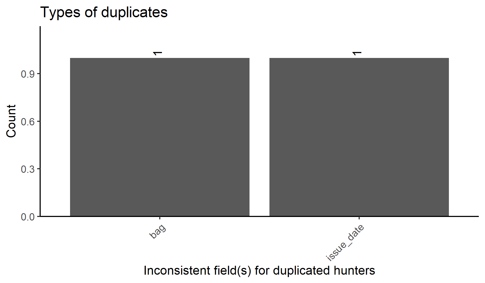

## Table of Contents

-   [Introduction](#introduction)
    -   [Installation](#installation)
        -   [Releases](#releases)
    -   [Load](#load)
    -   [Functions overview](#functions-overview)
-   [Part A: Data Import and Cleaning](#part-a-data-import-and-cleaning)
    -   [fileRename](#filerename)
    -   [fileCheck](#filecheck)
    -   [read_hip](#read_hip)
    -   [glyphCheck](#glyphcheck)
    -   [shiftCheck](#shiftcheck)
    -   [clean](#clean)
    -   [issueCheck](#issuecheck)
    -   [duplicateFinder](#duplicatefinder)
    -   [duplicatePlot](#duplicateplot)
    -   [duplicateFix](#duplicatefix)
    -   [bagCheck](#bagcheck)
-   [Part B: Data Proofing and Correction](#part-b-data-proofing-and-correction)
    -   [proof](#proof)
    -   [correct](#correct)
    -   [pullErrors](#pullerrors)
    -   [write_hip](#write_hip)
    -   [writeReport](#writereport)
-   [Part C: Data Visualization and Tabulation](#part-c-data-visualization-and-tabulation)
    -   Visualization
        -   [errorPlotFields](#errorplotfields)
        -   [errorPlotStates](#errorplotstates)
        -   [errorPlotDL](#errorplotdl)
    -   Tabulation
        -   [errorTable](#errortable)
        -   [redFlags](#redflags)
-   [Troubleshooting](#troubleshooting)
    -   [Common read_hip warnings](#common-read_hip-warnings)
    -   [Memory problems](#memory-problems)
    -   [Other](#other)

## Introduction {#introduction}

The `migbirdHIP` package was created by the U.S. Fish and Wildlife Service (USFWS) to process, clean, and visualize Harvest Information Program (HIP) registration data.

Every year, migratory game bird hunters must register for HIP in the state(s) they plan to hunt by providing their name, address, date of birth, and hunting success from the previous year. All 49 contiguous states are responsible for collecting this information and submitting hunter registrations to the USFWS. Raw data submitted by the states are processed in this package.

The USFWS has been using HIP registrations since 1999 to select hunters for the Migratory Bird Harvest Survey (Diary Survey) and the Parts Collection Survey (Wing Survey). Only a small proportion of HIP registrants are chosen to complete these surveys each year. The USFWS ultimately uses these data to generate annual harvest estimates. To read more about HIP and the surveys, visit: <https://www.fws.gov/harvestsurvey/> and <https://www.fws.gov/library/collections/migratory-bird-hunting-activity-and-harvest-reports>

### Installation {#installation}

The package can be installed from the USFWS GitHub repository using:


``` r
devtools::install_github("USFWS/migbirdHIP", quiet = T, upgrade = F, , build_vignettes = T)
```

#### Releases {#releases}

To install a past release, use the example below and substitute the appropriate version number.


``` r
devtools::install_github("USFWS/migbirdHIP@v1.2.8", build_vignettes = T)
```

### Load {#load}

Load `migbirdHIP` after installation. The package will return a startup message with the version you have installed and what season of HIP data the package version was intended for.


``` r
library(migbirdHIP)
```

### Functions overview {#functions-overview}

The flowchart below is a visual guide to the order in which functions are used. Some functions are only used situationally and some issues with the data cannot be solved using a function at all. The general process of handling HIP data is demonstrated here; every function in the `migbirdHIP` package is included.

<div class="figure" style="text-align: center">

<p class="caption">Overview of migbirdHIP functions in a flowchart format.</p>
</div>

## Part A: Data Import and Cleaning {#part-a-data-import-and-cleaning}

### fileRename {#filerename}

The `fileRename` function renames non-standard file names to the standard format. We expect a file name to be a 2-letter capitalized state abbreviation followed by YYYYMMDD (indicating the date data were submitted).

Some states submit files using a 5-digit file name format, containing 2 letters for the state abbreviation followed by a 3-digit Julian date. To convert these 5-digit filenames to the standard format (a requirement to read data properly with [read_hip](#read_hip)), supply `fileRename` with the directory containing HIP data. File names will be automatically overwritten with the YYYYMMDD format date corresponding to the submitted Julian date.

This function also converts lowercase state abbreviations to uppercase.

The current hunting season year must be supplied as a parameter to accurately convert dates.


``` r
fileRename(path = "C:/HIP/raw_data/DL0901", year = 2024)
```

### fileCheck {#filecheck}

Check if any files in the input folder have already been written to the processed folder.


``` r
fileCheck(
  raw_path = "C:/HIP/raw_data/DL0901/",
  processed_path = "C:/HIP/corrected_data/"
)
```

### read_hip {#read_hip}

Read HIP data from fixed-width .txt files using `read_hip`. Files must adhere to a 10-character naming convention to successfully be read in (2-letter capitalized state abbreviation followed by YYYYMMDD). If files were submitted with a 5-digit format or lowercase state abbreviation, run [fileRename](#filerename) first.

The `read_hip` function allows data to be read in for:

-   all states (e.g. `state = NA`, the default)
-   a specific state (e.g. `state = "DE"`)
-   a specific download (e.g. `season = FALSE`, the default)
-   an entire season (e.g. `season = TRUE`)

Use `unique = TRUE` to read in a frame without exact duplicates, or `unique = FALSE` to read in all records including exact duplicates. This function also:

-   Returns a message if one or more files are blank in the directory
-   Return a message by download state for records with blank or NA values in firstname, lastname, state, or birth date
-   Checks download state abbreviations in the .txt file names
-   Trims whitespace on all values
-   Converts "N/A" strings to NA
-   Creates a dl_state, dl_date, dl_cycle, and source_file column from each .txt filename
-   Creates a dl_key column by grouping data by dl_state and dl_date
-   Creates a record_key column (unique identifier for each row, used later by other functions)

We will use the default settings to read in all of the states from download 0901. Fake HIP data files located in the `extdata/DL0901/` directory of the R package will be used as an example.


``` r
raw_data <- read_hip("C:/HIP/DL0901/")
#> Error: NA values detected in one or more ID fields (firstname, lastname, state, birth date) for >10% of a file and/or >100 records.
#> # A tibble: 4 × 3
#>   dl_state     n proportion
#>   <chr>    <int>      <dbl>
#> 1 CO          22       0.1 
#> 2 MN          24       0.11
#> 3 VA          23       0.1 
#> 4 VT          24       0.11
#> Error: One or more records contain 'TEST' in first name and last name fields.
#> # A tibble: 1 × 4
#>   source_file    record_key  firstname lastname
#>   <chr>          <chr>       <chr>     <chr>   
#> 1 LA20240829.txt record_3840 TEST      TEST
#> Error: One or more records has a '0' in every bag field; these records will be filtered out in clean().
#> # A tibble: 18 × 2
#>    source_file    record_key  
#>    <chr>          <chr>       
#>  1 KY20240811.txt record_3489 
#>  2 OK20240809.txt record_7840 
#>  3 OR20240827.txt record_7924 
#>  4 OR20240827.txt record_7985 
#>  5 OR20240827.txt record_8016 
#>  6 OR20240827.txt record_8082 
#>  7 SC20240829.txt record_8663 
#>  8 TN20240902.txt record_9042 
#>  9 TN20240902.txt record_9156 
#> 10 WA20240823.txt record_10175
#> 11 WA20240823.txt record_10225
#> 12 WA20240823.txt record_10228
#> 13 WA20240823.txt record_10242
#> 14 WA20240823.txt record_10294
#> 15 WA20240823.txt record_10300
#> 16 WA20240823.txt record_10306
#> 17 WA20240823.txt record_10319
#> 18 WA20240823.txt record_10350
```

Did you get a warning? Read an explanation of common `read_hip` warnings [below](#common-read_hip-warnings).

### glyphCheck {#glyphcheck}

During pre-processing, R may throw an error that says something like "invalid UTF-8 byte sequence detected". The error usually includes a field name but no other helpful information. The `glyphCheck` function identifies values containing non-UTF-8 glyphs/characters and prints them with the source file in the console so they can be edited.


``` r
glyphCheck(raw_data)
```

### shiftCheck {#shiftcheck}

Find and print any rows that have a line shift error.


``` r
shiftCheck(raw_data)
```

### clean {#clean}

Clean the data after it has been read and checked.


``` r
clean_data <- clean(raw_data)
#> 2s converted to 0s for permit file states:
#> # A tibble: 8 × 3
#>   dl_state     n spp   
#>   <chr>    <int> <chr> 
#> 1 CO          98 cranes
#> 2 KS          99 cranes
#> 3 MT         108 cranes
#> 4 ND         115 cranes
#> 5 NM          95 cranes
#> 6 OK         107 cranes
#> 7 TX         106 cranes
#> 8 WY          87 cranes
#> 2s converted to 0s for permit file states:
#> # A tibble: 2 × 3
#>   dl_state     n spp               
#>   <chr>    <int> <chr>             
#> 1 CO          99 band_tailed_pigeon
#> 2 NM         101 band_tailed_pigeon
```

The `clean` function does simple data cleaning. Importantly, records are discarded if first name, last name, birth date, state of residence, address AND email, OR city AND zip AND email are missing.

Other quick fixes include:

-   Converts names to uppercase
-   Moves suffixes from first or last name columns to the appropriate suffix column (including any value from I to XX or 1ST to 20TH, except for XVIII)
-   If any value other than a letter is in the middle initial column, it's set to NA
-   Zip code correction
    -   Removes ending hyphen from zip codes with only 5 digits
    -   Trims 0s from 10th digit
    -   Inserts a hyphen in continuous 9 digit zip code values
    -   Inserts a hyphen in 9 digit zip codes with a middle space
    -   Deletes trailing -0000 and -\_\_\_\_ from zip codes
-   Address cleaning
    -   Deletes leading "." in addresses (a spillover character from suffix)
    -   Attempt at PO Box standardization, by changing "P.O.BOX" to "PO BOX" and "P.O. BOX" to "PO BOX"
-   Trims whitespace on all values (again)

### issueCheck {#issuecheck}

The `issueCheck` function filters out past registrations, returns messages for records received that should be saved for the future, and plots records that have a disagreement between registration year and issue date. To skip plotting, specify `plot = F`.


``` r
current_data <- issueCheck(clean_data, year = 2024, plot = F)
```


### duplicateFinder {#duplicatefinder}

The `duplicateFinder` function finds hunters that have more than one registration. Records are grouped by first name, last name, state, birth date, and download state to identify unique hunters. If the same hunter has 2 or more registrations, the fields that are not identical are counted and summarized.


``` r
duplicateFinder(current_data)
#> There are 32 registrations with duplicates; 64 total duplicated records.
#> # A tibble: 2 × 2
#>   duplicate_field     n
#>   <chr>           <int>
#> 1 bag                18
#> 2 issue_date         14
```

### duplicatePlot {#duplicateplot}

Plot duplicates.


``` r
duplicatePlot(current_data)
#> There are 32 registrations with duplicates; 64 total duplicated records.
```

<div class="figure" style="text-align: center">

<p class="caption">Figure 1. Plot of types of duplicates.</p>
</div>

### duplicateFix {#duplicatefix}

We sometimes receive multiple HIP records per person which must be resolved by `duplicateFix`. Only 1 HIP record per hunter can be kept. To decide which record to keep from a group, we follow a series of logic.

Records are kept when they meet the below criteria (in order of importance):

1.  The record in the group has the most recent issue date.
2.  Records do not contain all 1s or all 0s in bag columns.
3.  For duplicates from sea duck and brant states (AK, CA, CT, DE, MA, MD, NC, NH, NJ, NY, RI, VA), keep records with a 2 in seaduck or brant.
4.  For duplicates from seaduck-only state (ME), keep records with a 2 in seaduck.
5.  If records are tied, one is chosen randomly.

A new field called "record_type" is added to the data after the above deduplicating process. Every HIP record is labeled "HIP". Permit states WA and OR send HIP and permit records separately, which are labeled "HIP" and "PMT" respectively.

Note: This function replaces "." values with NA in non-permit species columns for WA and OR records.


``` r
deduplicated_data <- duplicateFix(current_data)
```

### bagCheck {#bagcheck}

Running `bagCheck` ensures species "bag" values are in order. This function searches for values in species group columns that are not typical or expected by the FWS. If a value outside of the normal range is detected, an output tibble is created. Each row in the output contains the state, species, unusual stratum value, and a list of the normal values we would expect.

If a value for a species group is given in the HIP data that doesn't match anything in our records, the species reported in the output will have NA values in the "normal_strata" column. These species are not hunted in the reported states.


``` r
bagCheck(deduplicated_data)
#> Joining with `by = join_by(dl_state, spp)`
#> Joining with `by = join_by(dl_state, spp, stateBagValue)`
#> # A tibble: 97 × 6
#>    dl_state spp          bad_bag_value expected_bag_value     n proportion
#>    <chr>    <chr>        <chr>         <chr>              <int> <chr>     
#>  1 TX       geese_bag    0             2, 3, 4                3 1%        
#>  2 AL       dove_bag     9             1, 2, 3, 5             1 0%        
#>  3 IL       dove_bag     9             1, 2, 3, 5             1 0%        
#>  4 KS       dove_bag     9             1, 2, 3, 5             2 1%        
#>  5 ME       woodcock_bag 9             1, 2, 3, 5             1 0%        
#>  6 ND       dove_bag     9             1, 2, 3, 5             1 0%        
#>  7 NV       dove_bag     9             1, 2, 3, 5             2 1%        
#>  8 WV       woodcock_bag 9             1, 2, 3, 5             1 0%        
#>  9 IN       woodcock_bag 9             1, 2, 3, 4, 5          1 0%        
#> 10 CA       geese_bag    9             1, 2, 3, 4             1 0%        
#> # ℹ 87 more rows
```

## Part B: Data Proofing and Correction {#part-b-data-proofing-and-correction}

### proof {#proof}

After data are cleaned and checked for any important issues that would require manual attention, we `proof`:


``` r
proofed_data <- proof(deduplicated_data, year = 2024)
```

Data that are considered irregular are flagged in a new column called "errors". No actual corrections take place in this step; all data remain identical except for the new "errors" column. For each field, values are compared to standard expected formats and if they do not conform, the field name is pasted as a string in the "errors" column. Each row can have from zero errors (NA) to all column names listed. Multiple flags are hyphen delimited.

The year of the Harvest Information Program must be supplied as a parameter. This aids in checking dates when licenses were issued, as one example.

### correct {#correct}

After the download data are proofed, the next step is to fix the data to the best of our ability. Data can be corrected by running the `correct` function on the proofed tibble. The year of the Harvest Information Program must be supplied as a parameter. Since the "errors" column is re-created using `correct`, supplying the year is necessary for the same reasons it is required by `proof`.


``` r
corrected_data <- correct(proofed_data, year = 2024)
```

The following changes are made by the `correct` function:

-   *Title* is changed to NA if it does not equal 1 or 2
-   *First name* is not changed, but remains flagged as an error if it breaks a following rule:
    -   Not \> 1 letter
    -   Contains a first initial and middle name
    -   Contains a first name and middle initial
    -   Contains non-alpha characters other than space or hyphen
    -   No full names (detected with 2+ spaces)
    -   Is not "BLANK", "INAUDIBLE", "TEST", "USER", or "RESIDENT"
-   *Middle initial* is not changed, but remains flagged if it is not exactly 1 letter
-   *Last name* is not changed, but remains flagged as an error if it breaks a following rule:
    -   Not \> 1 letter
    -   Contains a non-alpha character other than space, period, hyphen, or apostrophe
    -   No full names (Detected with 2+ spaces)
    -   Is not "INAUDIBLE"
-   *Suffix* is changed to NA if it is not equal to:
    -   JR or SR
    -   A value from I to VII in Roman numerals
    -   An value from 1ST to 9TH
-   *Address* is not changed, but remains flagged if it contains a \|, tab, or non-UTF8 character
-   *City* is not changed, but remains flagged if it contains any non-alpha character
-   *State* is not changed, but remains flagged if it is not contained in the following list of abbreviations for US and Canada states, provinces, and territories:
    -   AL, AK, AZ, AR, CA, CO, CT, DE, DC, FL, GA, HI, ID, IL, IN, IA, KS, KY, LA, ME, MD, MA, MI, MN, MS, MO, MT, NE, NV, NH, NJ, NM, NY, NC, ND, OH, OK, OR, PA, RI, SC, SD, TN, TX, UT, VT, VA, WA, WV, WI, WY, AS, GU, MP, PR, VI, UM, FM, MH, PW, AA, AE, AP, CM, CZ, NB, PI, TT, ON, QC, NS, NB, MB, BC, PE, SK, AB, NL
-   *Zip* is not changed, but is flagged if:
    -   If the hunter's address doesn't have a zip that should be in their reported state of residence (checked against a master list of USA postal codes), it's flagged
    -   Foreign zip codes are flagged
    -   Zip codes that do not match a 5-digit or 9-digit hyphenated format are flagged
-   *Birth date* is not changed, but remains flagged if the birth year was \> 100 or \< 16 years ago
-   *Issue date* is not changed, but remains flagged if it is not equal to or +/- 1 year from the HIP data collection year
-   *Hunt migratory birds* is not changed, and remains flagged if it is not equal to 1 or 2
-   *Bag values* remain unchanged
-   *Registration year* is not changed, but remains flagged if it is not equal to or +/- 1 year from the HIP data collection year
-   *Email* is corrected by:
    -   Removing spaces, commas, and/or forward slash symbols
    -   Changing to lowercase
    -   Replacing multiple \@ symbols with a single \@
    -   Adding periods and three-letter endings to common domains, including:
        -   gmail -\> gmail.com
        -   yahoo -\> yahoo.com
        -   aol -\> aol.com
        -   comcast -\> comcast.net
        -   verizon -\> verizon.net
        -   cox -\> cox.net
        -   outlook -\> outlook.com
        -   hotmail -\> hotmail.com
    -   Replace .ccom with .com
    -   Add missing periods before net, com, edu, and gov
    -   Change email to NA if:
        -   There is no \@ symbol in the email string
        -   If the email is invalid (i.e. none<!-- breaklink -->@none, noemail, n/a)
    -   Any email that wasn't corrected and doesn't fit the standardized email regex remains flagged

All functions in [Part C](#part-c-data-visualization-and-tabulation) will run on the corrected tibble, `corrected_data`, just as they worked on the example tibble `proofed_data`. Errors can be compared between the proofed stage and corrected stage to get a better idea of which errors were serious (i.e. difficult to correct automatically) and determine how serious errors can be prevented in the future.

### pullErrors {#pullerrors}

The `pullErrors` function can be used to view all of the actual values that were flagged as errors in a particular field. In this example, we find that the "suffix" field contains several values that are not accepted.


``` r
pullErrors(proofed_data, field = "suffix")
#> [1] "MD"  NA    "JR"  "PHD" "DVM" "SR"  "DDS"
```

Running `pullErrors` on a field that has no errors will return a message.


``` r
pullErrors(proofed_data, field = "dove_bag")
#> Success! All values are correct.
```

### write_hip {#write_hip}

After the data have been processed with `correct`, the table is ready to be written for the database. Use `write_hip` to do final processing to the table, which includes adding in FWS strata and setting NAs to blank strings. If `split = FALSE`, the final table will be saved as a single .csv to your specified path. If `split = TRUE` (default), one .csv file per each input .txt source file will be written to the specified directory.


``` r

write_hip(corrected_data, path = "C:/HIP/processed_data/")

```

### writeReport {#writereport}

The `writeReport` function can be used to automatically generate an R markdown document with figures, tables, and summary statistics. This can be done at the end of a download cycle.


``` r

# Windows only
memory.limit(size = 55000)

writeReport(
  raw_path = "C:/HIP/DL0901/",
  temp_path = "C:/HIP/corrected_data",
  year = 2024,
  dl = "0901",
  dir = "C:/HIP/dl_reports",
  file = "DL0901_report")

```

## Part C: Data Visualization and Tabulation {#part-c-data-visualization-and-tabulation}

### errorPlotFields {#errorplotfields}

The `errorPlotFields` function can be run on all states...


``` r
errorPlotFields(proofed_data, loc = "all", year = 2024)
```

<div class="figure" style="text-align: center">

<p class="caption">Figure 2. Plot of all location's errors by field name.</p>
</div>

... or it can be limited to just one.


``` r
errorPlotFields(proofed_data, loc = "LA", year = 2024)
```

<div class="figure" style="text-align: center">

<p class="caption">Figure 3. Plot of Louisiana's errors by field name.</p>
</div>

It is possible to add any `ggplot2` components to these plots. For season total data specifically, the plot can be facet_wrapped using either dl_cycle or dl_date. The example below demonstrates how this package's functions can interact with the tidyverse and shows an example of an `errorPlotFields` facet_wrap (using a subset of 4 download cycles)


``` r
errorPlotFields(
  hipdata2024 |>
    filter(str_detect(dl_cycle, "0800|0901|0902|1001")),
    year = 2024) +
  theme(
    axis.text.x = element_text(angle = 90, vjust = 0, hjust = 1),
    legend.position = "bottom") +
  facet_wrap(~dl_cycle, ncol = 2)
```

### errorPlotStates {#errorplotstates}

The `errorPlotStates` function plots error proportions per state. You may optionally set a threshold value to only view states above a certain proportion of error. Bar labels are error counts.


``` r
errorPlotStates(proofed_data)
```

<div class="figure" style="text-align: center">

<p class="caption">Figure 5. Plot of proportion of error by state.</p>
</div>

### errorPlotDL {#errorplotdl}

This function should not be used unless you want to visualize an entire season of data. The `errorPlot_dl` function plots proportion of error per download cycle across the year. Location may be specified to see a particular state over time.


``` r
errorPlot_dl(hipdata2024, loc = "MI")
```

<div class="figure" style="text-align: center">

<p class="caption">errorPlot_dl example output</p>
</div>

### errorTable {#errortable}

The `errorTable` function is a flexible way to obtain error data as a tibble, which can be assessed as needed or exported to create records of download cycle errors. The basic function reports errors by both location and field.


``` r
errorTable(proofed_data)
#> # A tibble: 293 × 3
#>    dl_state error     error_count
#>    <chr>    <chr>           <int>
#>  1 AK       email               4
#>  2 AK       firstname         206
#>  3 AK       lastname          205
#>  4 AK       middle             69
#>  5 AK       suffix            208
#>  6 AK       zip               110
#>  7 AL       email               5
#>  8 AL       firstname         203
#>  9 AL       lastname          198
#> 10 AL       middle             70
#> # ℹ 283 more rows
```

Errors can be reported by only location by turning off the `field` parameter.


``` r
errorTable(proofed_data, field = "none")
#> # A tibble: 49 × 2
#>    dl_state error_count
#>    <chr>          <int>
#>  1 AK               802
#>  2 AL               795
#>  3 AR               828
#>  4 AZ               865
#>  5 CA               823
#>  6 CO               766
#>  7 CT               807
#>  8 DE               811
#>  9 FL               834
#> 10 GA               795
#> # ℹ 39 more rows
```

Errors can be reported by only field by turning off the `loc` parameter.


``` r
errorTable(proofed_data, loc = "none")
#> # A tibble: 6 × 2
#>   error     error_count
#>   <chr>           <int>
#> 1 email             234
#> 2 firstname       10131
#> 3 lastname        10110
#> 4 middle           3076
#> 5 suffix          10237
#> 6 zip              5921
```

Location can be specified.


``` r
errorTable(proofed_data, loc = "CA")
#> # A tibble: 6 × 3
#>   dl_state error     error_count
#>   <chr>    <chr>           <int>
#> 1 CA       email               2
#> 2 CA       firstname         209
#> 3 CA       lastname          213
#> 4 CA       middle             58
#> 5 CA       suffix            214
#> 6 CA       zip               127
```

Field can be specified.


``` r
errorTable(proofed_data, field = "suffix")
#> # A tibble: 1 × 2
#>   error  error_count
#>   <chr>        <int>
#> 1 suffix       10237
```

Total errors for a location can be pulled.


``` r
errorTable(proofed_data, loc = "CA", field = "none")
#> # A tibble: 1 × 2
#>   dl_state total_errors
#>   <chr>           <int>
#> 1 CA                823
```

Total errors for a field in a particular location can be pulled.


``` r
errorTable(proofed_data, loc = "CA", field = "dove_bag")
#> No errors in dove_bag for CA.
```

## Troubleshooting {#troubleshooting}

If you encounter a problem while using this R package, please [report an issue](https://github.com/USFWS/migbirdHIP/issues) on the [migbirdHIP GitHub repository](https://github.com/USFWS/migbirdHIP).

### Common read_hip warnings {#common-read_hip-warnings}

Sometimes `read_hip` will throw one or more warnings. Warnings are usually benign, but for clarity I provide examples and explanations of common warnings below.

#### Example 1

This parsing failure occurs when a .txt file is missing the last two columns in the fixed-width file (registration_yr and email). For the offending file(s), these columns are filled with NA in the output tibble. No action must be taken.

<div class="figure" style="text-align: center">

<p class="caption">Example 1. Common warning that results after running read_hip with missing columns in fixed-width text files.</p>
</div>

#### Example 2

Another version of a parsing failure occurs when a file is missing the last column in last row of the fixed-width file. This value is set to NA in the output tibble. No action must be taken.

<div class="figure" style="text-align: center">

<p class="caption">Example 2. Common warning that results after running read_hip with a missing column in one row of a fixed-width text file.</p>
</div>

### Memory problems {#memory-problems}

Some of these functions require a lot of memory to run. To help your R session process these data, especially when working with the large season totals, you can do a few things:

1.  Remove objects from the environment. If you have already run `read_hip`, `clean`, and `proof`, you may no longer need your original dataframe or your cleaned dataframe, since most error checking functions work from the proofed or corrected versions of the data. To remove an unneeded object like the cleaned dataframe, run `rm(clean_data)`, or set it to `NULL` via `clean_data <- NULL`.

2.  Check your memory using `memory.limit()`

3.  Increase your memory, e.g. `memory.limit(size = 55000)`
