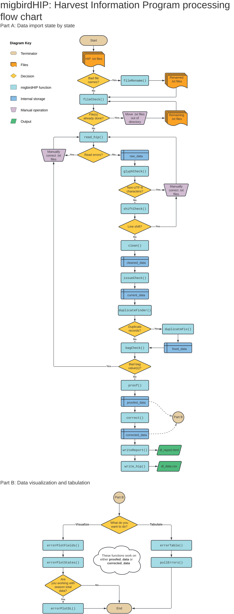

## Table of Contents

- [Introduction](#introduction)
    - [Installation](#installation)
    - [Functions overview](#functions-overview)
- [Part A: Data Import and Cleaning](#part-a-data-import-and-cleaning)
    - [renameFiles](#renamefiles)
    - [fileCheck](#filecheck)
    - [read_hip](#read_hip)
    - [glyphCheck](#glyphcheck)
    - [shiftCheck](#shiftcheck)
    - [clean](#clean)
    - [issueCheck](#issuecheck)
    - [findDuplicates](#findduplicates)
    - [fixDuplicates](#fixduplicates)
    - [strataCheck](#stratacheck)
    - [identicalBags](#identicalbags)
    - [validate](#validate)
- [Part B: Data Proofing and Correction](#part-b-data-proofing-and-correction)
    - [proof](#proof)
    - [correct](#correct)
    - [pullErrors](#pullerrors)
    - [write_hip](#write_hip)
    - [writeReport](#writereport)
- [Part C: Data Visualization and Tabulation](#part-c-data-visualization-and-tabulation)
    - Visualization
        - [outOfStateHunters](#outofstatehunters)
        - [youthHunters](#youthhunters)
        - [errorPlot_fields](#errorplot_fields)
        - [errorPlot_states](#errorplot_states)
        - [errorPlot_dl](#errorplot_dl)
    - Tabulation
        - [errorTable](#errortable)
        - [redFlags](#redflags)
- [Troubleshooting](#troubleshooting)
    - [Common read_hip warnings](#common-read_hip-warnings)
    - [Memory problems](#memory-problems)
    - [Other](#other)

## Introduction

The *migbirdHIP* package was created for the U.S. Fish and Wildlife Service (USFWS) to wrangle, tidy, and visualize Harvest Information Program (HIP) data.

HIP data have been used since 1999 to make important management decisions for migratory game birds in the United States. Raw hunting activity data are processed in this package. To read more about HIP, visit: [https://www.fws.gov/harvestsurvey/](https://www.fws.gov/harvestsurvey/)

### Installation

The package can be installed from the USFWS GitHub repository using:

```r
devtools::install_github("USFWS/migbirdHIP", quiet = T, upgrade = F, , build_vignettes = T)
```

### Functions overview

The flowchart below is a visual guide to the order in which functions are used. Some functions are only used situationally and some issues with the data cannot be solved using a function at all. The general process of handling HIP data is demonstrated here; every function in the *migbirdHIP* package is included.



## Part A: Data Import and Cleaning

### renameFiles

The `renameFiles` function was incorporated into this package for special cases. Some states submit .txt  files using a 5-digit file name format, containing 2 letters for the state abbreviation followed by a 3-digit Julian date (representing the date the file was uploaded). To convert these 5-digit filenames to the standard 10-digit format (a requirement to read data properly with [read_hip](#read_hip)), supply the `renameFiles` with the directory containing HIP data. File names will be automatically overwritten with the YYYYMMDD format date corresponding to the submitted Julian date. This function also converts lowercase state abbreviations to uppercase. The year of the Harvest Information Program must be supplied as a parameter to accurately convert dates.


```r
renameFiles(path = "C:/HIP/DL1301", year = 2021)
```

### fileCheck

Check if any files in the input folder have already been written to the processed folder.


```r
fileCheck(
  raw_path = "C:/HIP/DL1301",
  processed_path = "C:/HIP/corrected_data"
)
```

### read_hip

The first step is to import fixed-width .txt files containing HIP data. Files must adhere to a 10-digit naming convention in order to successfully import data using the `read_hip` function; if files were submitted with the old 5-digit format, run [renameFiles](#renamefiles) first.

The `read_hip` function allows data to be read in for all states (e.g. `state = NA`, the default), for just a specific state (e.g. `state = "DE"`), a specific download (e.g. `season = FALSE`, the default) or data over an entire season (e.g. `season = TRUE`). Use `unique = TRUE` to read in a frame without exact duplicates, or `unique = FALSE` for all records. This function also:

* Returns a message if one or more files are blank in the directory
* Return a message by download state for records with blank or NA values in firstname, lastname, state, or birth date
* Checks download state abbreviations in the .txt file names
* Trims whitespace on all values
* Converts "N/A" strings to NA
* Creates a dl_state, dl_date, dl_cycle, and source_file column from each .txt filename
* Creates a dl_key column by grouping data by dl_state and dl_date
* Creates a record_key column (unique identifier for each row, used later by other functions)

We will use the default settings to read in all of the states from download 1301.


```r
library(migbirdHIP)

DL1301 <- read_hip("C:/HIP/DL1301", sumlines = F)
```

Did you get a warning or three? Read an explanation of common `read_hip` warnings, [below](#common-read_hip-warnings).

### glyphCheck

During pre-processing, R may throw an error like "invalid UTF-8 byte sequence detected". The error usually includes a field name but no other helpful information. The `glyphCheck` function identifies values containing non-UTF-8 glyphs/characters and returns them with the source file so they can be edited.


```r
glyphCheck(DL1301)
```

### shiftCheck

Find and print any rows that have a line shift error.


```r
shiftCheck(DL1301)
```

### clean

After data are read and unshifted, we `clean`:


```r
DL1301_clean <- clean(DL1301)
```

```
## 2s converted to 0s for permit file states:
```

```
## # A tibble: 4 × 3
##   dl_state     n spp               
##   <chr>    <int> <chr>             
## 1 NM          46 band_tailed_pigeon
## 2 UT          10 band_tailed_pigeon
## 3 CO          17 cranes            
## 4 NM          34 cranes
```

This function does simple data cleaning. Importantly, records are discarded if first name, last name, birth date, state of residence, address AND email, OR city AND zip AND email are missing.

Other quick fixes include:

* Converts names to uppercase
* Moves suffixes from first or last name columns to the appropriate suffix column (including any value from I to XX or 1ST to 20TH, except for XVIII)
* If any value other than a letter is in the middle initial column, it's set to NA
* Zip code correction
    * Removes ending hyphen from zip codes with only 5 digits
    * Trims 0s from 10th digit
    * Inserts a hyphen in continuous 9 digit zip code values
    * Inserts a hyphen in 9 digit zip codes with a middle space
    * Deletes trailing -0000 and -____ from zip codes
* Address cleaning
    * Deletes leading "." in addresses (a spillover character from suffix)
    * Attempt at PO Box standardization, by changing "P.O.BOX" to "PO BOX" and "P.O. BOX" to "PO BOX"
* Trims whitespace on all values (again)

### issueCheck

The `issueCheck` function filters out past registrations, returns messages for records received that should be saved for the future, and plots records that have a disagreement between registration year and issue date. To skip plotting, specify `plot = F`.


```r
DL1301_current <- issueCheck(DL1301_clean, year = 2021, plot = F)
```


### findDuplicates

The `findDuplicates` function finds hunters that have more than one registration. Records are grouped by first name, last name, state, birth date, registration year, and download state to identify unique hunters. If the same hunter has 2 or more registrations, the fields that are not identical are counted and summarized. A plot is returned by default, but the type of output can be specified using `return = "plot"` for plot, or `return = "table"` for table and summary message.


```r
findDuplicates(DL1301_current)
```


```r
findDuplicates(DL1301_current, return = "table")
```

```
## # A tibble: 13 × 2
##    dupl                                         count
##    <chr>                                        <int>
##  1 address                                          2
##  2 address-city                                     1
##  3 address-email                                    2
##  4 address-zip-email                                1
##  5 address-zip-issue_date                           1
##  6 bag                                            480
##  7 email                                            2
##  8 issue_date                                      25
##  9 issue_date-dl_date                               1
## 10 issue_date-hunt_mig_birds-dl_date                3
## 11 middle                                           5
## 12 middle-address-city-zip-hunt_mig_birds-email     1
## 13 suffix-issue_date-email                          1
```

### fixDuplicates

We sometimes receive multiple HIP records per person which must be resolved by `fixDuplicates`. Only 1 HIP record per hunter can be kept. To decide which record to keep from a group, we follow a series of logic.

Records are kept when they meet the below criteria (in order of importance):

1. The record in the group has the most recent issue date.
2. Records do not contain all 1s or all 0s in bag columns.
3. For duplicates from sea duck and brant states (AK, CA, CT, DE, MA, MD, NC, NH, NJ, NY, RI, VA), keep records with a 2 in seaduck or brant.
4. For duplicates from seaduck-only state (ME), keep records with a 2 in seaduck.
5. If records are tied, one is chosen randomly.

A new field called "record_type" is added to the data after the above deduplicating process. Every HIP record is labeled "HIP". Permit states WA and OR send HIP and permit records separately, which are labeled "HIP" and "PMT" respectively.

Note: This function replaces "." values with NA in non-permit species columns for WA and OR records.


```r
DL1301_fixed <- fixDuplicates(DL1301_current)
```

### strataCheck

Running `strataCheck` ensures species "bag" values are in order. This function searches for values in species group columns that are not typical or expected by the FWS. If a value outside of the normal range is detected, an output tibble is created. Each row in the output contains the state, species, unusual stratum value, and a list of the normal values we would expect.

If a value for a species group is given in the HIP data that doesn't match anything in our records, the species reported in the output will have NA values in the "normal_strata" column. These species are not hunted in the reported states.


```r
strataCheck(DL1301_fixed)
```

```
## Joining with `by = join_by(dl_state, spp)`
## Joining with `by = join_by(dl_state, spp, stateBagValue)`
```

```
## # A tibble: 30 × 6
##    dl_state spp              state_strata normal_strata     n prop 
##    <chr>    <chr>            <chr>        <chr>         <int> <chr>
##  1 FL       dove_bag         0            1, 2, 3, 5        2 0%   
##  2 IA       dove_bag         0            1, 2, 3, 5      279 9%   
##  3 TN       dove_bag         0            1, 2, 3, 5       85 4%   
##  4 TN       woodcock_bag     0            1, 2, 3, 5       85 4%   
##  5 IA       ducks_bag        0            1, 2, 3, 4     2841 89%  
##  6 IA       geese_bag        0            1, 2, 3, 4     2841 89%  
##  7 TN       ducks_bag        0            1, 2, 3, 4       85 4%   
##  8 TN       geese_bag        0            1, 2, 3, 4       85 4%   
##  9 FL       rails_gallinules 0            1, 2              3 0%   
## 10 IA       woodcock_bag     0            1, 2           2841 89%  
## # ℹ 20 more rows
```

### identicalBags

Check to make sure the data from each file don't have any columns that are exactly the same.


```r
identicalBags(DL1301_fixed)
```

```
## # A tibble: 4 × 6
##   source_file    spp1               spp2             n value   dl_state
##   <chr>          <chr>              <chr>        <int> <chr>   <chr>   
## 1 IA20211215.txt rails_gallinules   woodcock_bag  3175 0, 1, 2 IA      
## 2 OR20211229.txt band_tailed_pigeon brant          813 0       OR      
## 3 WA20211215.txt band_tailed_pigeon coots_snipe   1737 1       WA      
## 4 WA20211229.txt band_tailed_pigeon coots_snipe   1460 1       WA
```

### validate

The `validate` function looks for repeated values in two dimensions, both horizontally and vertically.

<b>Horizontally.</b> The horizontal check for repetition looks across records and finds any rows with same value in each species group column. Details in the output tibble include: the repeated value (h_value), number of records with repeats (h_rep), total number of records (h_total), and proportion of repeated values per file (prop_repeat). The default version of this function (`all = FALSE`) only checks ducks, geese, and coots_snipe bags. If the parameter is set to `all = TRUE`, every species group will be checked.


```r
validate(DL1301_fixed, type = "horizontal")
```

```
## # A tibble: 49 × 5
##    source_file    h_value h_rep h_total prop_repeat
##    <chr>          <chr>   <int>   <int>       <dbl>
##  1 IA20211215.txt 0        2841    3175       0.895
##  2 AL20211229.txt 1        4224    4791       0.882
##  3 WI20211229.txt 1         273     323       0.845
##  4 MO20211229.txt 1        2697    3604       0.748
##  5 ME20211229.txt 1         112     151       0.742
##  6 NM20211229.txt 1         208     295       0.705
##  7 ID20211229.txt 1        1762    2588       0.681
##  8 ND20211215.txt 1         130     204       0.637
##  9 CA20211229.txt 1        2003    3211       0.624
## 10 IN20211229.txt 1         416     690       0.603
## # ℹ 39 more rows
```

<b>Vertically.</b> The vertical check searches within each column for repetition. Any species group column with the same value in all rows will be detected. The default version of this function (`all = FALSE`) only checks duck bags. If the parameter is set to `all = TRUE`, every species group will be checked.


```r
validate(DL1301_fixed, type = "vertical")
```

```
## # A tibble: 1 × 4
##   dl_state dl_date  spp       v_repeated
##   <chr>    <chr>    <chr>          <int>
## 1 AK       20211228 ducks_bag         65
```

It is not possible to include as much detail in the vertical output as in the horizontal output without being specific about which state, species, and time scale you wish to assess.

If there are no repetitions, a positive message will be returned.

## Part B: Data Proofing and Correction

### proof

After data are cleaned and checked for any important issues that would require manual attention, we `proof`:


```r
DL1301_proofed <- proof(DL1301_fixed, year = 2021)
```

Data that are considered irregular are flagged in a new column called "errors". No actual corrections take place in this step; all data remain identical except for the new "errors" column. For each field, values are compared to standard expected formats and if they do not conform, the field name is pasted as a string in the "errors" column. Each row can have from zero errors (NA) to all column names listed. Multiple flags are hyphen delimited.

The year of the Harvest Information Program must be supplied as a parameter. This aids in checking dates when licenses were issued, as one example.

### correct

After the download data are proofed, the next step is to fix the data to the best of our ability. Data can be corrected by running the `correct` function on the proofed tibble. The year of the Harvest Information Program must be supplied as a parameter. Since the "errors" column is re-created using `correct`, supplying the year is necessary for the same reasons it is required by `proof`.


```r
DL1301_corrected <- correct(DL1301_proofed, year = 2021)
```

The following changes are made by the `correct` function:

* *Title* is changed to NA if it does not equal 1 or 2
* *First name* is not changed, but remains flagged as an error if it breaks a following rule:
    * Not > 1 letter
    * Contains a first initial and middle name
    * Contains a first name and middle initial
    * Contains non-alpha characters other than space or hyphen
    * No full names (detected with 2+ spaces)
    * Is not "BLANK", "INAUDIBLE", "TEST", "USER", or "RESIDENT"
* *Middle initial* is not changed, but remains flagged if it is not exactly 1 letter
* *Last name* is not changed, but remains flagged as an error if it breaks a following rule:
    * Not > 1 letter
    * Contains a non-alpha character other than space, period, hyphen, or apostrophe
    * No full names (Detected with 2+ spaces)
    * Is not "INAUDIBLE"
* *Suffix* is changed to NA if it is not equal to:
    * JR or SR
    * A value from I to VII in Roman numerals
    * An value from 1ST to 9TH
* *Address* is not changed, but remains flagged if it contains a |, tab, or non-UTF8 character
* *City* is not changed, but remains flagged if it contains any non-alpha character
* *State* is not changed, but remains flagged if it is not contained in the following list of abbreviations for US and Canada states, provinces, and territories:
    * AL, AK, AZ, AR, CA, CO, CT, DE, DC, FL, GA, HI, ID, IL, IN, IA, KS, KY, LA, ME, MD, MA, MI, MN, MS, MO, MT, NE, NV, NH, NJ, NM, NY, NC, ND, OH, OK, OR, PA, RI, SC, SD, TN, TX, UT, VT, VA, WA, WV, WI, WY, AS, GU, MP, PR, VI, UM, FM, MH, PW, AA, AE, AP, CM, CZ, NB, PI, TT, ON, QC, NS, NB, MB, BC, PE, SK, AB, NL
* *Zip* is not changed, but is flagged if:
    * If the hunter's address doesn't have a zip that should be in their reported state of residence (checked against a master list of USA postal codes), it's flagged
    * Foreign zip codes are flagged
    * Zip codes that do not match a 5-digit or 9-digit hyphenated format are flagged
* *Birth date* is not changed, but remains flagged if the birth year was > 100 or < 16 years ago
* *Issue date* is not changed, but remains flagged if it is not equal to or +/- 1 year from the HIP data collection year
* *Hunt migratory birds* is not changed, and remains flagged if it is not equal to 1 or 2
* *Bag values* remain unchanged
* *Registration year* is not changed, but remains flagged if it is not equal to or +/- 1 year from the HIP data collection year
* *Email* is corrected by:
    * Removing spaces, commas, and/or forward slash symbols
    * Changing to lowercase
    * Replacing multiple @ symbols with a single @
    * Adding periods and three-letter endings to common domains, including:
        * gmail -> gmail.com
        * yahoo -> yahoo.com
        * aol -> aol.com
        * comcast -> comcast.net
        * verizon -> verizon.net
        * cox -> cox.net
        * outlook -> outlook.com
        * hotmail -> hotmail.com
    * Replace .ccom with .com
    * Add missing periods before net, com, edu, and gov
    * Change email to NA if:
        * There is no @ symbol in the email string
        * If the email is invalid (i.e. none<!-- breaklink -->@none, noemail, n/a)
    * Any email that wasn't corrected and doesn't fit the standardized email regex remains flagged

All functions in [Part C](#part-c-data-visualization-and-tabulation) will run on the corrected tibble, `DL1301_corrected`, just as they worked on the example tibble `DL1301_proofed`. Errors can be compared between the proofed stage and corrected stage to get a better idea of which errors were serious (i.e. difficult to correct automatically) and determine how serious errors can be prevented in the future.

### pullErrors

The `pullErrors` function can be used to view all of the actual values that were flagged as errors in a particular field. In this example, we find that the "suffix" field contains several values that are not accepted.


```r
pullErrors(DL1301_proofed, field = "suffix")
```

```
##  [1] "MD"  "ESQ" "MAL" "MR"  "W"   "CJS" "CME" "M"   "SMI" "I�M" "MO" 
## [12] "MS"  "MRS" "-"
```

Running `pullErrors` on a field that has no errors will return a message.


```r
pullErrors(DL1301_proofed, field = "dove_bag")
```

```
## Success! All values are correct.
```

### write_hip

After the data have been processed with `correct`, the table is ready to be written for the database. Use `write_hip` to do final processing to the table, which includes adding in FWS strata and setting NAs to blank strings. If `split = FALSE`, the final table will be saved as a single .csv to your specified path. If `split = TRUE` (default), one .csv file per each input .txt source file will be written to the specified directory.


```r
write_hip(DL1301_corrected, path = "C:/HIP/processed_data/")
```

### writeReport

The `writeReport` function can be used to automatically generate an R markdown document with figures, tables, and summary statistics. This can be done at the end of a download cycle.


```r
# Windows only
memory.limit(size = 55000)

writeReport(
  raw_path = "C:/HIP/DL1301",
  temp_path = "C:/HIP/corrected_data",
  year = 2019,
  dl = "1301",
  dir = "C:/HIP/dl_reports",
  file = "DL1301_report")
```

## Part C: Data Visualization and Tabulation

### outOfStateHunters

The `outOfStateHunters` function plots and tabulates how many hunters registered in a download state that does not match the state, province, or territory of their address. This function plots proportion of out-of-staters with counts as bar labels. The tibble contains counts and proportions by state.


```r
outOfStateHunters(DL1301_proofed)
```


### youthHunters

The `youthHunters` function returns a table and plot of the number of hunters with birth dates < 16 years from the year of HIP data collection. These data are interesting to explore because hunters younger than 16 years of age are not required to have a migratory bird hunting license in the United States.


```r
youthHunters(DL1301_proofed, year = 2021)
```


### errorPlot_fields

The `errorPlot_fields` function can be run on all states...


```r
errorPlot_fields(DL1301_proofed, loc = "all", year = 2021)
```


... or it can be limited to just one.


```r
errorPlot_fields(DL1301_proofed, loc = "LA", year = 2021)
```


The `youth` parameter can be set to TRUE for `errorPlot_fields` to view the proportion of "errors" created by youth hunters. Youth hunters are not included in the error plot if `youth = FALSE` (set as default).


```r
errorPlot_fields(DL1301_proofed, year = 2021, youth = TRUE)
```


It is possible to add any `ggplot2` components to these plots. For season total data specifically, the plot can be facet_wrapped using either dl_cycle or dl_date. The example below demonstrates how this package's functions can interact with the tidyverse and shows an example of an `errorPlot_fields` facet_wrap (using a subset of 4 download cycles)


```r
errorPlot_fields(
  hipdata2020 |>
    filter(str_detect(dl_cycle, "0800|0901|0902|1001")),
    year = 2021) +
  theme(
    axis.text.x = element_text(angle = 90, vjust = 0, hjust = 1),
    legend.position = "bottom") +
  facet_wrap(~dl_cycle, ncol = 2)
```

### errorPlot_states

The `errorPlot_states` function plots error proportions per state. You may optionally set a threshold value to only view states above a certain proportion of error. Bar labels are error counts.


```r
errorPlot_states(DL1301_proofed)
```


### errorPlot_dl

This function should not be used unless you want to visualize an entire season of data. The `errorPlot_dl` function plots proportion of error per download cycle across the year. Location may be specified to see a particular state over time.


```r
errorPlot_dl(hipdata2020, loc = "MI")
```


### errorTable

The `errorTable` function is a flexible way to obtain error data as a tibble, which can be assessed as needed or exported to create records of download cycle errors. The basic function reports errors by both location and field.


```r
errorTable(DL1301_proofed)
```

```
## # A tibble: 114 × 3
##    dl_state error           error_count
##    <chr>    <chr>                 <int>
##  1 AK       registration_yr           1
##  2 AL       birth_date                2
##  3 AL       city                     13
##  4 AL       email                     3
##  5 AL       firstname                 5
##  6 AL       registration_yr        4791
##  7 AL       state                     1
##  8 AL       suffix                    5
##  9 AL       zip                      17
## 10 CA       birth_date              173
## # ℹ 104 more rows
```

Errors can be reported by only location by turning off the `field` parameter.


```r
errorTable(DL1301_proofed, field = "none")
```

```
## # A tibble: 28 × 2
##    dl_state error_count
##    <chr>          <int>
##  1 AK                 1
##  2 AL              4837
##  3 CA               175
##  4 CO                69
##  5 CT               420
##  6 FL                32
##  7 GA                31
##  8 IA                61
##  9 ID               179
## 10 IN                59
## # ℹ 18 more rows
```

Errors can be reported by only field by turning off the `loc` parameter.


```r
errorTable(DL1301_proofed, loc = "none")
```

```
## # A tibble: 10 × 2
##    error           error_count
##    <chr>                 <int>
##  1 birth_date             1308
##  2 city                     43
##  3 email                   378
##  4 firstname                48
##  5 lastname                 14
##  6 registration_yr        7302
##  7 state                     3
##  8 suffix                   37
##  9 title                     3
## 10 zip                     176
```

Location can be specified.


```r
errorTable(DL1301_proofed, loc = "CA")
```

```
## # A tibble: 2 × 3
##   dl_state error      error_count
##   <chr>    <chr>            <int>
## 1 CA       birth_date         173
## 2 CA       title                2
```

Field can be specified.


```r
errorTable(DL1301_proofed, field = "suffix")
```

```
## # A tibble: 1 × 2
##   error  error_count
##   <chr>        <int>
## 1 suffix          37
```

Total errors for a location can be pulled.


```r
errorTable(DL1301_proofed, loc = "CA", field = "none")
```

```
## # A tibble: 1 × 2
##   dl_state total_errors
##   <chr>           <int>
## 1 CA                175
```

Total errors for a field in a particular location can be pulled.


```r
errorTable(DL1301_proofed, loc = "CA", field = "dove_bag")
```

```
## No errors in dove_bag for CA.
```

### redFlags

<b>By state.</b>
States with an unacceptable level of error can be pulled into a tibble. The tibble contains information pertaining to state, the count of errors from that state, the number of correct records from that state, the proportion of error per state, and a "flag" column that prints the threshold used. Any threshold can be supplied; in this example, we see which states had more than 3% error.


```r
redFlags(DL1301_proofed, type = "state", threshold = 0.03)
```

```
## # A tibble: 5 × 5
##   dl_state count_errors count_correct proportion flag        
##   <chr>           <int>         <dbl>      <dbl> <chr>       
## 1 CT                420          3094     0.120  error > 0.03
## 2 VT                365          4619     0.0732 error > 0.03
## 3 AL               4837         62237     0.0721 error > 0.03
## 4 LA               1817         23383     0.0721 error > 0.03
## 5 WV                195          3921     0.0474 error > 0.03
```

<b>By field.</b>
The same can be done for data fields. In this example, we see which fields had more than 1% error.


```r
redFlags(DL1301_proofed, type = "field", threshold = 0.01)
```

```
## # A tibble: 2 × 5
##   errors          count_errors count_correct proportion flag        
##   <chr>                  <int>         <int>      <dbl> <chr>       
## 1 registration_yr         7302         41160     0.151  error > 0.01
## 2 birth_date              1308         47154     0.0270 error > 0.01
```

## Troubleshooting

### Common read_hip warnings

Sometimes `read_hip` will throw one or more warnings. Warnings are usually benign, but for clarity I provide examples and explanations of common warnings below. If the warning or error you receive after reading HIP data isn't described here and seems like a real problem, please [report an issue](#other).

#### Example 1

This parsing failure occurs when a .txt file is missing the last two columns in the fixed-width file (registration_yr and email). For the offending file(s), these columns are filled with NA in the output tibble. No action must be taken.


#### Example 2

Another version of a parsing failure occurs when a file is missing the last column in last row of the fixed-width file. This value is set to NA in the output tibble. No action must be taken.


### Memory problems

Some of these functions require a lot of memory to run. To help your R session process these data, especially when working with the large season totals, you can do a few things:

1. Remove objects from the environment. If you have already run `read_hip`, `clean`, and `proof`, you may no longer need your original dataframe or your cleaned dataframe, since most error checking functions work from the proofed or corrected versions of the data. To remove an unneeded object like the cleaned dataframe, run `rm(DL1301_clean)`.

2. Check your memory using `memory.limit()`

3. Increase your memory, e.g. `memory.limit(size = 55000)`

### Other

<b>Issue reporting</b>

If you find a bug in the package, it's advised to [create an issue](https://github.com/USFWS/migbirdHIP/issues) at the package's GitHub repo, https://github.com/USFWS/migbirdHIP.

<b>Questions?</b>

Contact Abby Walter, abby_walter@fws.gov

