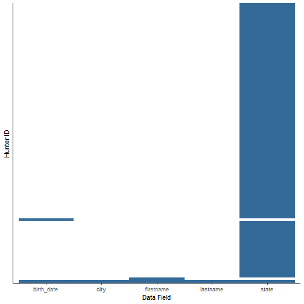

## Table of Contents

- [Introduction](#introduction)
    - [Installation](#installation)
    - [Functions overview](#functions-overview)
- [Part A: Data Import and Cleaning](#part-a-data-import-and-cleaning)
    - [read_hip](#read_hip)
    - [renameFiles](#renamefiles)
    - [clean](#clean)
    - [findDuplicates](#findduplicates)
    - [fixDuplicates](#fixduplicates)
    - [strataCheck](#stratacheck)
    - [validate](#validate)
    - [investigate](#investigate)
- [Part B: Data Proofing and Correction](#part-b-data-proofing-and-correction)
    - [proof](#proof)
    - [correct](#correct)
    - [pullErrors](#pullerrors)
    - [manualFix](#manualfix)
    - [write_hip](#write_hip)
    - [writeReport](#writereport)
    - [writeShiny](#writeshiny)
- [Part C: Data Visualization and Tabulation](#part-c-data-visualization-and-tabulation)
    - Visualization
        - [outOfStateHunters](#outofstatehunters)
        - [youthHunters](#youthhunters)
        - [errorPlot_fields](#errorplot_fields)
        - [errorPlot_states](#errorplot_states)
        - [errorPlot_dl](#errorplot_dl)
    - Tabulation
        - [errorTable](#errortable)
        - [redFlags](#redflags)
- [Troubleshooting](#troubleshooting)
    - [Common read_hip warnings](#common-read_hip-warnings)
    - [Memory problems](#memory-problems)
    - [Other](#other)

## Introduction

The *migbirdHarvestData* package was created for the U.S. Fish and Wildlife Service (USFWS) to wrangle, tidy, and visualize Harvest Information Program (HIP) data.

HIP data have been used since 1999 to make important management decisions for migratory game birds in the United States. Raw hunting activity data are processed in this package. To read more about HIP, visit: [https://www.fws.gov/harvestsurvey/](https://www.fws.gov/harvestsurvey/)

### Installation

The package can be installed from the USFWS GitHub repository using:

```r
library(devtools)
install_github("USFWS/migbirdHarvestData")
```

### Functions overview

The flowchart below is a visual guide to the order in which functions are used. Some functions are only used situationally and some issues with the data cannot be solved using a function at all. The general process of handling HIP data is demonstrated here; every function in the *migbirdHarvestData* package is included.


## Part A: Data Import and Cleaning

### read_hip

The first step is to import .txt files containing HIP data. Files must adhere to a 10-digit naming convention in order to successfully import data using the `read_hip` function; if files were submitted with the old 5-digit format, run [renameFiles](#renamefiles) first.

The `read_hip` function allows data to be read in for just a specific state or for an entire season (parameters "state" and "season", respectively). We will use the default settings to read in all of the states from download 1202.


```r
library(migbirdHarvestData)

DL1202 <- read_hip("C:/HIP/DL1202")
```

Did you get a warning or three? Read an explanation of common `read_hip` warnings, [below](#common-read_hip-warnings).

### renameFiles

The `renameFiles` function was incorporated into this package for special cases. Some states submit .txt  files using the "old" 5-digit file name format, containing 2 letters for the state abbreviation followed by a 3-digit Julian date (representing the date the file was uploaded). To convert these pesky 5-digit filenames to the standard 10-digit format (a requirement to read data properly with [read_hip](#read_hip)), supply the `renameFiles` with the directory containing HIP data. File names will be automatically overwritten with the YYYYMMDD format date corresponding to the submitted Julian date.


```r
renameFiles(path = "C:/HIP/DL1202")
```

### clean

After data are imported, we `clean`:


```r
DL1202_clean <- clean(DL1202, plot = TRUE)
```



This function renames columns and does simple mutations. Importantly, records are discarded if first name, last name, city of residence, state of residence, or date of birth are missing. These records with missing values can be visualized using `plot = TRUE`.

Other quick fixes include:

* Converts names to uppercase
* Moves suffixes from first or last name columns to the appropriate suffix column
* Removes punctuation from middle initial column
* Removes ending hyphen from zip codes with only 5 digits

### findDuplicates

The `findDuplicates` function finds hunters that have more than one registration. Records are grouped by first name, last name, city, state, birth date, and download state to identify unique hunters. If the same hunter has 2 or more registrations, the fields that are not identical are counted and summarized. A plot is returned by default, but the type of output can be specified using `return = "plot"` for plot, or `return = "table"` for table and summary message.


```r
findDuplicates(DL1202_clean)
```


```r
findDuplicates(DL1202_clean, return = "table")
```

```
## # A tibble: 18 x 2
##    dupl                     count
##    <chr>                    <int>
##  1 address                      4
##  2 address-email                1
##  3 address-issue_date           1
##  4 address-issue_date-email     1
##  5 bag                         14
##  6 email                        4
##  7 issue_date                  33
##  8 issue_date-email             1
##  9 middle-address               1
## 10 middle-address-email         2
## 11 middle-issue_date            2
## 12 middle-issue_date-email      1
## 13 middle-zip-email             1
## 14 registration_yr              2
## 15 suffix                       1
## 16 suffix-address-email         1
## 17 suffix-issue_date            1
## 18 zip                          1
```

### fixDuplicates

We sometimes receive multiple HIP records per person which must be resolved by `fixDuplicates`. Only 1 HIP record per hunter can be kept (although we do allow multiple permits per hunter). To decide which record to keep from a group, we follow a series of logic.

Records are kept when they meet the below criteria (in order of importance):

1. The record in the group has the most recent issue date.
2. Records do not contain all 1s or all 0s in bag columns.
3. The record in the group has a current registration year.
4. If records are tied, one is chosen randomly.

Duplicates from Atlantic Flyway states (ME, VT, NH, MA, RI, CT, NY, PA, NY, DE, MD, VA, WV, NC, SC, GA, FL) have an additional rule that preferentially keeps records with a 2 in brant or seaduck.
Permit states WA, OR, CO, and SD send HIP and permit records separately, which are identified as "HIP" and "PMT" respectively in the record_type column. Dove records from Iowa are marked as "IAD" in the record_type column.

Note: This function replaces "." values with NA in non-permit species columns for WA, OR, CO, and SD records.


```r
DL1202_fixed <- fixDuplicates(DL1202_clean)
```

```
## Warning: Problem with `mutate()` input `x_bags`.
## i `select_()` is deprecated as of dplyr 0.7.0.
## Please use `select()` instead.
## This warning is displayed once every 8 hours.
## Call `lifecycle::last_warnings()` to see where this warning was generated.
## i Input `x_bags` is `pmap_chr(...)`.
```

```
## Warning: `select_()` is deprecated as of dplyr 0.7.0.
## Please use `select()` instead.
## This warning is displayed once every 8 hours.
## Call `lifecycle::last_warnings()` to see where this warning was generated.
```

```
## Error: Problem with `mutate()` input `x_bags`.
## x no applicable method for 'select_' applied to an object of class "rlang_data_pronoun"
## i Input `x_bags` is `pmap_chr(...)`.
```

### strataCheck

Running `strataCheck` ensures species "bag" values are in order. This function searches for values in species group columns that are not typical or expected by the FWS. If a value outside of the normal range is detected, an output tibble is created. Each row in the output contains the state, species, unusual stratum value, and a list of the normal values we would expect.

If a value for a species group is given in the HIP data that doesn't match anything in our records, the species reported in the output will have NA values in the "normal_strata" column. These species are not hunted in the reported states.


```r
strataCheck(DL1202_fixed)
```

```
## Error: `select()` doesn't handle lists.
```

### validate

The `validate` function looks for repeated values in two dimensions, both horizontally and vertically.

<b>Horizontally.</b> The horizontal check for repetition looks across records and finds any rows with same value in each species group column. Details in the output tibble include: the repeated value (h_value), number of records with repeats (h_rep), total number of records (h_total), and proportion of repeated values per file (prop_repeat). The default version of this function (`all = FALSE`) only checks ducks, geese, dove, and woodcock bags. If the parameter is set to `all = TRUE`, every species group will be checked.


```r
validate(DL1202_fixed, type = "horizontal")
```

```
## Error: `select()` doesn't handle lists.
```

<b>Vertically.</b> The vertical check searches within each column for repetition. Any species group column with the same value in all rows will be detected. *Coming soon:* States that do not have a hunting season for one or more species groups (e.g. seaducks) will not be returned using this function for reporting all zero values. The default version of this function (`all = FALSE`) only checks duck bags. If the parameter is set to `all = TRUE`, every species group will be checked.

The two time period options to assess vertical repetition are `period = "dl_date"` (used automatically)...


```r
validate(DL1202_fixed, type = "vertical")
```

```
## Error: `select()` doesn't handle lists.
```

... and `period = "dl_cycle"`.


```r
validate(DL1202_fixed, type = "vertical", period = "dl_cycle")
```

```
## Error: `select()` doesn't handle lists.
```

It is not possible to include as much detail in the vertical output as in the horizontal output without being specific about which state, species, and time scale you wish to assess. Vertical repetition returned in the output from this function can be looked at more closely using `investigate`.

If there are no repetitions, a positive message will be returned.

### investigate

Did the vertical output from the `validate` function return repeated values? Are some of those values a high number that are repeated and need to be looked at more closely? The `investigate` function allows you to see what value was vertically repeated for a species. Parameters required are download state, type of download time period, value of the download date or download cycle, and species — all of this information is provided in the vertical `validate` output.


```r
investigate(
  DL1202_fixed,
  loc = "AK",
  period_type = "dl_date",
  period = "20201215",
  species = "dove_bag")
```

```
## Error: `select()` doesn't handle lists.
```

## Part B: Data Proofing and Correction

### proof

After data are cleaned and checked for any important issues that would require manual attention, we `proof`:


```r
DL1202_proofed <- proof(DL1202_fixed, year = 2020)
```

```
## Error in UseMethod("mutate_"): no applicable method for 'mutate_' applied to an object of class "list"
```

Data that are considered irregular are flagged in a new column called "errors". No actual corrections take place in this step; all data remain identical except for the new "errors" column. For each field, values are compared to standard expected formats and if they do not conform, the field name is pasted as a string in the "errors" column. Each row can have from zero errors (NA) to all column names listed. Multiple flags are hyphen delimited.

The year of the Harvest Information Program must be supplied as a parameter. This aids in checking dates when licenses were issued, as one example.

### correct

After the download data are proofed, the next step is to fix the data to the best of our ability. Data can be corrected by running the `correct` function on the proofed tibble. You must specify whether the function should return original state bag values (`data = "bag"`) or FWS strata values (`data = "strata"`).


```r
DL1202_corrected <- correct(DL1202_proofed, year = 2020, data = "bag")
```

```
## Error in mutate(., errors = ifelse(is.na(errors), "none", errors), title = ifelse(str_detect(errors, : object 'DL1202_proofed' not found
```

The following changes are made by the `correct` function:

* *Title* is changed to NA if it does not equal 1 or 2
* *First name* is not changed, but remains flagged as an error if it breaks a following rule:
    * Not > 1 letter
    * Contains a first initial and middle name
    * Contains a first name and middle initial
    * Contains non-alpha characters other than space or hyphen
    * No full names (detected with 2+ spaces)
    * Is not "BLANK", "INAUDIBLE", "TEST", "USER", or "RESIDENT"
* *Middle initial* is not changed, but remains flagged if it is not exactly 1 letter
* *Last name* is not changed, but remains flagged as an error if it breaks a following rule:
    * Not > 1 letter
    * Contains a non-alpha character other than space, period, hyphen, or apostrophe
    * No full names (Detected with 2+ spaces)
    * Is not "INAUDIBLE"
* *Suffix* is changed to NA if it is not equal to:
    * JR or SR
    * A value from I to VII in Roman numerals
    * An value from 1ST to 9TH
* *Address* is not changed, but remains flagged if it contains a |, tab, or non-UTF8 character
* *City* is not changed, but remains flagged if it contains any non-alpha character
* *State* is not changed, but remains flagged if it is not contained in the following list of abbreviations for US and Canada states, provinces, and territories:
    * AL, AK, AZ, AR, CA, CO, CT, DE, DC, FL, GA, HI, ID, IL, IN, IA, KS, KY, LA, ME, MD, MA, MI, MN, MS, MO, MT, NE, NV, NH, NJ, NM, NY, NC, ND, OH, OK, OR, PA, RI, SC, SD, TN, TX, UT, VT, VA, WA, WV, WI, WY, AS, GU, MP, PR, VI, UM, FM, MH, PW, AA, AE, AP, CM, CZ, NB, PI, TT, ON, QC, NS, NB, MB, BC, PE, SK, AB, NL
* *Zip* is corrected by:
    * Inserting a hyphen into continuous 9-digit zip codes
    * Replacing a central space with a hyphen
    * Deleting trailing -0000 and -____
    * Checking corrected zip codes against a master list of USA postal codes; if the hunter's address doesn't have a zip that should be in their state, it's flagged
    * Foreign zip codes are flagged
    * Zip codes that do not match a 5-digit or 9-digit hyphenated format are flagged
* *Birth date* is not changed, but remains flagged if the birth year was > 100 or < 16 years ago
* *Issue date* is not changed, but remains flagged if it is not equal to or +/- 1 year from the HIP data collection year
* *Hunt migratory birds* is not changed, and remains flagged if it is not equal to 1 or 2
* *Bag values*
    * State strata that do not meet expected values are compared to a master list and corrected to standard FWS strata
    * Any stratum that can't be converted is changed to NA
* *Registration year* is not changed, but remains flagged if it is not equal to or +/- 1 year from the HIP data collection year
* *Email* is corrected by:
    * Removing spaces, commas, and/or forward slash symbols
    * Changing to lowercase
    * Replacing multiple @ symbols with a single @
    * Adding periods and three-letter endings to common domains, including:
        * gmail -> gmail.com
        * yahoo -> yahoo.com
        * aol -> aol.com
        * comcast -> comcast.net
        * verizon -> verizon.net
        * cox -> cox.net
        * outlook -> outlook.com
        * hotmail -> hotmail.com
    * Replace .ccom with .com
    * Add missing periods before net, com, edu, and gov
    * Change email to NA if:
        * There is no @ symbol in the email string
        * If the email is invalid (i.e. none<!-- breaklink -->@none, noemail, n/a)
    * Any email that wasn't corrected and doesn't fit the standardized email regex remains flagged

The year of the Harvest Information Program must be supplied as a parameter. Since the "errors" column is re-created using `correct`, supplying the year is necessary for the same reasons it is required by `proof`.

All functions in [Part C](#part-c-data-visualization-and-tabulation) will run on the corrected tibble, `DL1202_corrected`, just as they worked on the example tibble `DL1202_proofed`. Errors can be compared between the proofed stage and corrected stage to get a better idea of which errors were serious (i.e. difficult to correct automatically) and determine how serious errors can be prevented in the future.

### pullErrors

The `pullErrors` function can be used to view all of the actual values that were flagged as errors in a particular field. In this example, we find that the "dove_bag" field contains entries of "4" and "9", when the only values permissible are 0, 1, 2, 3, and 5.


```r
pullErrors(DL1202_proofed, error = "dove_bag")
```

```
## Error in select(., error, errors): object 'DL1202_proofed' not found
```

### manualFix

The automated `correct` function cannot always catch and fix every error. To finish the job, `manualFix` function replaces specified inaccurate values with the values you want. It is not recommended that this function only be used after correcting the data; it's best used on a case-by-case basis. In the instance of frame shifts, for example, it would be wise to use after `clean`. Or if problems are only identified after `proof`, you can run `manualFix` on the cleaned data and re-run `proof`. This function is highly flexible and recommended to be used as needed.


```r
manualFix(DL1202_corrected, field = "state", error_value = "GS", correct_value = "GA")
```

### write_hip

After the data have been processed with `correct`, the table is ready to be written for the database. Use `write_hip` to do final processing to the table, which includes dropping some columns and setting NAs to blank strings. The final table will be saved as a csv to your specified path.


```r
write_hip(DL1202_corrected, path = "C:/HIP/all_2019")
```

### writeReport

The `writeReport` function can be used to automatically generate an R markdown document with figures, tables, and summary statistics. This can be done at the end of a download cycle (using `type = "dl_report"`) or the entire HIP season (with `type = "season_report"`). You should expect this function to run for ~1 minute for a download cycle, or ~30 minutes for a total season (containing approximately 4 million records). Writing a total season report is a memory intensive process, so for this option, we recommend [increasing your memory](#memory-problems) allocated to R.


```r
# Windows only
memory.limit(size = 55000)

writeReport(
  path = "C:/HIP/all_2019",
  type = "season_report",
  yr = 2019,
  dir = "H:/r_projects/hip_data/script",
  file = "season_report_2019")
```

### writeShiny

The `writeShiny` function is a supplement to the `writeReport` function. It launches an instance of Shiny through R, allowing users to interact with a `findDuplicates` plot to view duplicates by state. Features of the data can be explored quickly without weighing down the `writeReport` function with repetitive facet wrapping. The shiny plot cannot be saved to an html document to view again in the future; R has to run the `writeShiny` function each time.


```r
writeShiny(
  path = "C:/HIP/all_2019",
  type = "season_shiny",
  yr = 2019)
```

## Part C: Data Visualization and Tabulation

### outOfStateHunters

The `outOfStateHunters` function plots and tabulates how many hunters registered in a download state that does not match the state, province, or territory of their address. This function plots proportion of out-of-staters with counts as bar labels. The tibble contains counts and proportions by state.


```r
outOfStateHunters(DL1202_proofed)
```

```
## Error in select(., state, dl_state): object 'DL1202_proofed' not found
```

### youthHunters

The `youthHunters` function returns a table and plot of the number of hunters with birth dates < 16 years from the year of HIP data collection. These data are interesting to explore because hunters younger than 16 years of age are not required to have a migratory bird hunting license in the United States.


```r
youthHunters(DL1202_proofed, year = 2020)
```

```
## Error in group_by(., dl_state): object 'DL1202_proofed' not found
```

### errorPlot_fields

The `errorPlot_fields` function can be run on all states...


```r
errorPlot_fields(DL1202_proofed, loc = "all", year = 2020)
```

```
## Error in mutate(., birth_year = str_extract(birth_date, "(?<=\\/)[0-9]{4}$"), : object 'DL1202_proofed' not found
```

... or it can be limited to just one.


```r
errorPlot_fields(DL1202_proofed, loc = "LA", year = 2020)
```

```
## Error in filter(., dl_state == loc): object 'DL1202_proofed' not found
```

The `youth` parameter can be set to TRUE for `errorPlot_fields` to view the proportion of "errors" created by youth hunters. Youth hunters are not included in the error plot if `youth = FALSE` (set as default).


```r
errorPlot_fields(DL1202_proofed, year = 2020, youth = TRUE)
```

```
## Error in mutate(., birth_year = str_extract(birth_date, "(?<=\\/)[0-9]{4}$"), : object 'DL1202_proofed' not found
```

It is possible to add any `ggplot2` components to these plots. For season total data specifically, the plot can be facet_wrapped using either dl_cycle or dl_date. The example below demonstrates how this package's functions can interact with the tidyverse and shows an example of an `errorPlot_fields` facet_wrap (using a subset of 4 download cycles)


```r
errorPlot_fields(
  hipdata2020 %>%
    filter(str_detect(dl_cycle, "0800|0901|0902|1001")),
    year = 2020) +
  theme(
    axis.text.x = element_text(angle = 90, vjust = 0, hjust = 1),
    legend.position = "bottom") +
  facet_wrap(~dl_cycle, ncol = 2)
```

### errorPlot_states

The `errorPlot_states` function plots error proportions per state. You may optionally set a threshold value to only view states above a certain proportion of error. Bar labels are error counts.


```r
errorPlot_states(DL1202_proofed)
```

```
## Error in select(., errors, dl_state): object 'DL1202_proofed' not found
```

### errorPlot_dl

This function should not be used unless you want to visualize an entire season of data. The `errorPlot_dl` function plots proportion of error per download cycle across the year. Location may be specified to see a particular state over time.


```r
errorPlot_dl(hipdata2020, loc = "MI")
```


### errorTable

The `errorTable` function is a flexible way to obtain error data as a tibble, which can be assessed as needed or exported to create records of download cycle errors. The basic function reports errors by both location and field.


```r
errorTable(DL1202_proofed)
```

```
## Error in select(., errors, dl_state): object 'DL1202_proofed' not found
```

Errors can be reported by only location by turning off the `field` parameter.


```r
errorTable(DL1202_proofed, field = "none")
```

```
## Error in select(., errors, dl_state): object 'DL1202_proofed' not found
```

Errors can be reported by only field by turning off the `loc` parameter.


```r
errorTable(DL1202_proofed, loc = "none")
```

```
## Error in select(., errors, dl_state): object 'DL1202_proofed' not found
```

Location can be specified.


```r
errorTable(DL1202_proofed, loc = "CA")
```

```
## Error in select(., errors, dl_state): object 'DL1202_proofed' not found
```

Field can be specified.


```r
errorTable(DL1202_proofed, field = "suffix")
```

```
## Error in select(., errors, dl_state): object 'DL1202_proofed' not found
```

Total errors for a location can be pulled.


```r
errorTable(DL1202_proofed, loc = "CA", field = "none")
```

```
## Error in select(., errors, dl_state): object 'DL1202_proofed' not found
```

Total errors for a field in a particular location can be pulled.


```r
errorTable(DL1202_proofed, loc = "CA", field = "dove_bag")
```

```
## Error in select(., errors, dl_state): object 'DL1202_proofed' not found
```

### redFlags

<b>By state.</b>
States with an unacceptable level of error can be pulled into a tibble. The tibble contains information pertaining to state, the count of errors from that state, the number of correct records from that state, the proportion of error per state, and a "flag" column that prints the threshold used. Any threshold can be supplied; in this example, we see which states had more than 3% error.


```r
redFlags(DL1202_proofed, type = "state", threshold = 0.03)
```

```
## Error in select(., errors, dl_state): object 'DL1202_proofed' not found
```

<b>By field.</b>
The same can be done for data fields. In this example, we see which fields had more than 1% error.


```r
redFlags(DL1202_proofed, type = "field", threshold = 0.01)
```

```
## Error in select(., errors): object 'DL1202_proofed' not found
```

## Troubleshooting

### Common read_hip warnings

Sometimes `read_hip` will throw one or more warnings. Warnings are usually benign, but for clarity I provide examples and explanations of common warnings below. If the warning or error you receive after reading HIP data isn't described here and seems like a real problem, please [report an issue](#other).

#### Example 1

This parsing failure occurs when a .txt file is missing the last two columns in the fixed-width file (registration_yr and email). For the offending file(s), these columns are filled with NA in the output tibble. No action must be taken.


#### Example 2

Another version of a parsing failure occurs when a file is missing the last column in last row of the fixed-width file. This value is set to NA in the output tibble. No action must be taken.


### Memory problems

Some of these functions require a lot of memory to run. To help your R session process these data, especially when working with the large season totals, you can do a few things:

1. Remove objects from the environment. If you have already run `read_hip`, `clean`, and `proof`, you may no longer need your original dataframe or your cleaned dataframe, since most error checking functions work from the proofed or corrected versions of the data. To remove an unneeded object like the cleaned dataframe, run `rm(DL1202_clean)`.

2. Check your memory using `memory.limit()`

3. Increase your memory, e.g. `memory.limit(size = 55000)`

### Other

<b>Issue reporting</b>

If you find a bug in the package, it's advised to [create an issue](https://github.com/USFWS/migbirdHarvestData/issues) at the package's GitHub repo, https://github.com/USFWS/migbirdHarvestData.

<b>Questions?</b>

Contact Abby Walter, abby_walter@fws.gov

