## Table of Contents

- [Introduction](#introduction)
    - [Installation](#installation)
    - [Functions overview](#functions-overview)
- [Part A: Data Import and Cleaning](#part-a-data-import-and-cleaning)
    - [read_hip](#read_hip)
    - [clean](#clean)
    - [findDuplicates](#findduplicates)
    - [fixDuplicates](#fixduplicates)
    - [strataCheck](#stratacheck)
    - [validate](#validate)
    - [investigate](#investigate)
- [Part B: Data Proofing and Correction](#part-b-data-proofing-and-correction)
    - [proof](#proof)
    - [correct](#correct)
    - [pullErrors](#pullerrors)
    - [manualFix](#manualfix)
    - [writeReport](#writereport)
    - [writeShiny](#writeshiny)
- [Part C: Data Visualization and Tabulation](#part-c-data-visualization-and-tabulation)
    - Visualization
        - [outOfStateHunters](#outofstatehunters)
        - [youthHunters](#youthhunters)
        - [errorPlot_fields](#errorplot_fields)
        - [errorPlot_states](#errorplot_states)
        - [errorPlot_dl](#errorplot_dl)
    - Tabulation
        - [errorTable](#errortable)
        - [redFlags](#redflags)
        - [hunterSample](#huntersample)
- [Troubleshooting](#troubleshooting)
    - [Common read_hip warnings](#common-read_hip-warnings)
    - [Memory problems](#memory-problems)
    - [Other](#other)

## Introduction

The *migbirdHarvestData* package was created for the U.S. Fish and Wildlife Service (USFWS) to wrangle, tidy, and visualize Harvest Information Program (HIP) data.

HIP data have been used since 1999 to make important management decisions for migratory game birds in the United States. Raw hunting activity data are processed in this package. To read more about HIP, visit: [https://www.fws.gov/harvestsurvey/](https://www.fws.gov/harvestsurvey/)

### Installation

The package can be installed from the USFWS GitHub repository using:

```r
library(devtools)
install_github("USFWS/migbirdHarvestData")
```

### Functions overview

The flowchart below is a visual guide to the order in which functions are used. Some functions are only used situationally and some issues with the data cannot be solved using a function at all. The general process of handling HIP data is demonstrated here; every function in the *migbirdHarvestData* package is included except for [hunterSample](#huntersample).

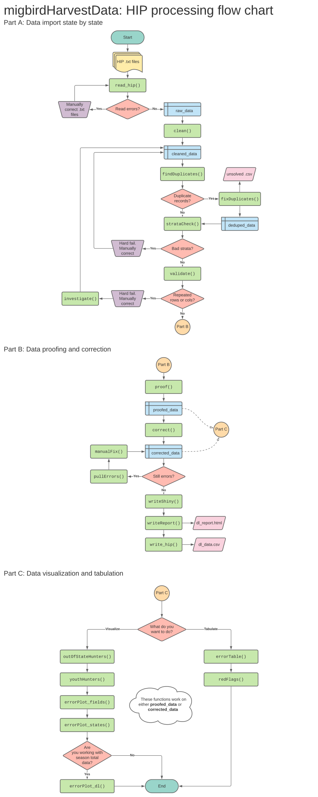

## Part A: Data Import and Cleaning

### read_hip

The first step is to import .txt files containing HIP data. To do this, we use the `read_hip` function. This function allows data to be read in for just a specific state or for an entire season (parameters "state" and "season", respectively). We will use the default settings to read in all of the states from download 1202.


```r
library(migbirdHarvestData)

DL1202 <- read_hip("C:/HIP/DL1202")
```

Did you get a warning or three? Read an explanation of common `read_hip` warnings, [below](#common-read_hip-warnings).

### clean

After data are imported, we `clean`:


```r
DL1202_clean <- clean(DL1202)
```

This function renames columns and does simple mutations, such as:

* Converts names to uppercase
* Moves suffixes from first or last name columns to the appropriate suffix column
* Removes punctuation from middle initial column
* Removes ending hyphen from zip codes with only 5 digits

### findDuplicates

The `findDuplicates` function finds hunters that have more than one registration. Records are grouped by first name, last name, city, state, birth date, and download state to identify unique hunters. If the same hunter has 2 or more registrations, the fields that are not identical are counted and summarized. A plot is returned by default, but the type of output can be specified using `return = "plot"` for plot, or `return = "table"` for table and summary message.


```r
findDuplicates(DL1202_clean)
```

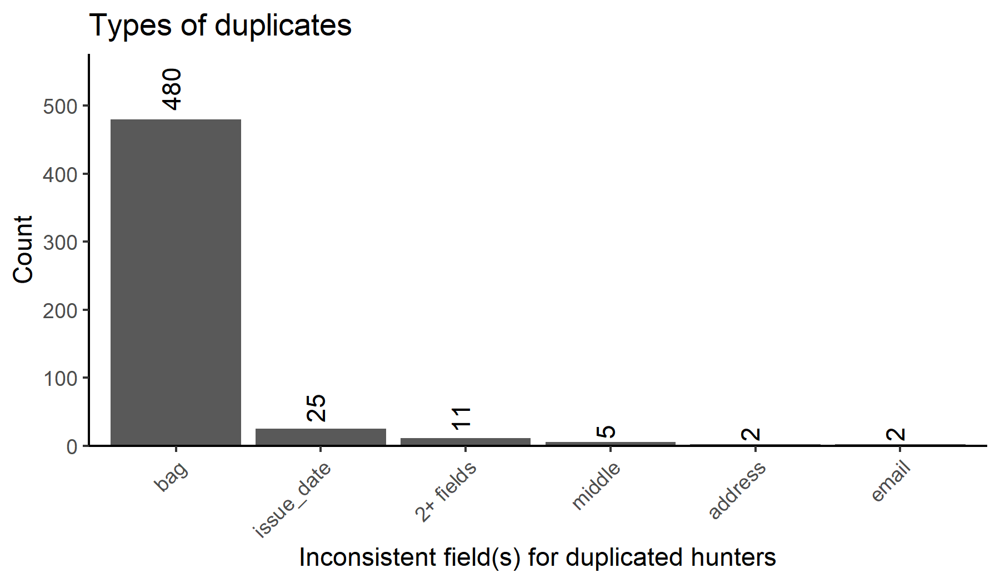


```r
findDuplicates(DL1202_clean, return = "table")
```

```
## # A tibble: 18 x 2
##    dupl                     count
##    <chr>                    <int>
##  1 address                      4
##  2 address-email                1
##  3 address-issue_date           1
##  4 address-issue_date-email     1
##  5 bag                         14
##  6 email                        4
##  7 issue_date                  33
##  8 issue_date-email             1
##  9 middle-address               1
## 10 middle-address-email         2
## 11 middle-issue_date            2
## 12 middle-issue_date-email      1
## 13 middle-zip-email             1
## 14 registration_yr              2
## 15 suffix                       1
## 16 suffix-address-email         1
## 17 suffix-issue_date            1
## 18 zip                          1
```

### fixDuplicates

States that require special permits to hunt migratory bird species (i.e. cranes, Band-tailed Pigeons, sea ducks and Brant) sometimes send permit information and HIP download data on separate lines. These cases are a common cause of duplicates (>1 row per hunter) and are problematic for future analyses if retained. The `fixDuplicates` function attempts to identify such cases and will consolidate hunters with multiple records (i.e. a HIP record and a permit record in the same download state) into one row. It consolidates duplicates with 2 rows two ways. First, `fixDuplicates` removes permit records with no take noted (i.e., all "0"" values). Then for remaining duplicates, the function replaces "0" values in HIP records with non-zero values in paired permit records.

Duplicates with > 2 records usually can't be resolved with any certainty. For these records, the HIP row is retained and duplicates are set aside in a separate tibble. The `fixDuplicates` function returns a list in the output containing 1) "fixed_dl", which is the input table with duplicates removed, and 2) "unsolved_duplicates", which contains duplicates with > 2 records that cannot be resolved. Records are labeled in each table in a new field labeled "record_type", with combined HIP/Permit records indicated with "hip-permit", original HIP records with "hip", and unsolved duplicates with "unsolved".

Note: This function replaces "." values in species fields with "0" values for WA, OR, CO, and SD records. Usually, this step occurs in `correct`, but it must be done here for duplicate removal to work successfully.


```r
DL1202_fDlist <- fixDuplicates(DL1202_clean)

DL1202_fixed <- DL1202_fDlist$fixed_duplicates
DL1202_unsolved <- DL1202_fDlist$unsolved_duplicates

# Remove the large list from global environment
rm(DL1202_fDlist)
```

### strataCheck

Running `strataCheck` ensures species "bag" values are in order. This function searches for values in species group columns that are not typical or expected by the FWS. If a value outside of the normal range is detected, an output tibble is created. Each row in the output contains the state, species, unusual stratum value, and a list of the normal values we would expect.

If a value for a species group is given in the HIP data that doesn't match anything in our records, the species reported in the output will have NA values in the "normal_strata" column. These species are not hunted in the reported states.


```r
strataCheck(DL1202_fixed)
```

```
## # A tibble: 285 x 4
##    dl_state spp                state_strata normal_strata   
##    <chr>    <chr>              <chr>        <chr>           
##  1 OR       dove_bag           0            1, 2, 3, 5      
##  2 OR       ducks_bag          0            1, 2, 3, 4      
##  3 OR       geese_bag          0            1, 2, 3, 4      
##  4 OR       band_tailed_pigeon 0            1, 2            
##  5 OR       brant              0            1, 2            
##  6 OR       seaducks           0            1, 2            
##  7 MO       dove_bag           9            0, 1, 2, 3, 5   
##  8 NE       dove_bag           9            0, 1, 2, 3, 5   
##  9 MO       woodcock_bag       9            0, 1, 2, 3, 4, 5
## 10 NE       woodcock_bag       6            0, 1, 2, 3, 4, 5
## # ... with 275 more rows
```

### validate

The `validate` function looks for repeated values in two dimensions, both horizontally and vertically.

<b>Horizontally.</b> The horizontal check for repetition looks across records and finds any rows with same value in each species group column. Details in the output tibble include: the repeated value (h_value), number of records with repeats (h_rep), total number of records (h_total), and proportion of repeated values per file (prop_repeat). The default version of this function (`all = FALSE`) only checks ducks, geese, dove, and woodcock bags. If the parameter is set to `all = TRUE`, every species group will be checked.


```r
validate(DL1202_fixed, type = "horizontal")
```

```
## # A tibble: 47 x 5
##    source_file    h_value h_rep h_total prop_repeat
##    <chr>          <chr>   <int>   <int>       <dbl>
##  1 wi20201216.txt 1         465     546       0.852
##  2 AL20201216.txt 1        5755    7025       0.819
##  3 MI20201216.txt 1         340     416       0.817
##  4 SC20201202.txt 1        6301    7824       0.805
##  5 MS20201215.txt 1        6704    8919       0.752
##  6 MO20201216.txt 1        2954    4047       0.730
##  7 RI20201216.txt 1         101     155       0.652
##  8 CT20201216.txt 1          69     110       0.627
##  9 OH20201216.txt 1         629    1057       0.595
## 10 MN20201216.txt 1         731    1277       0.572
## # ... with 37 more rows
```

<b>Vertically.</b> The vertical check searches within each column for repetition. Any species group column with the same value in all rows will be detected. *Coming soon:* States that do not have a hunting season for one or more species groups (e.g. seaducks) will not be returned using this function for reporting all zero values. The default version of this function (`all = FALSE`) only checks duck bags. If the parameter is set to `all = TRUE`, every species group will be checked.

The two time period options to assess vertical repetition are `period = "dl_date"` (used automatically)...


```r
validate(DL1202_fixed, type = "vertical")
```

```
## Data are good to go! No vertical repetition detected.
```

... and `period = "dl_cycle"`.


```r
validate(DL1202_fixed, type = "vertical", period = "dl_cycle")
```

```
## Data are good to go! No vertical repetition detected.
```

It is not possible to include as much detail in the vertical output as in the horizontal output without being specific about which state, species, and time scale you wish to assess. Vertical repetition returned in the output from this function can be looked at more closely using `investigate`.

If there are no repetitions, a positive message will be returned.

### investigate

Did the vertical output from the `validate` function return repeated values? Are some of those values a high number that are repeated and need to be looked at more closely? The `investigate` function allows you to see what value was vertically repeated for a species. Parameters required are download state, type of download time period, value of the download date or download cycle, and species — all of this information is provided in the vertical `validate` output.


```r
investigate(
  DL1202_fixed,
  loc = "AK",
  period_type = "dl_date",
  period = "20201215",
  species = "dove_bag")
```

```
## # A tibble: 1 x 2
##   dove_bag source_file   
##   <chr>    <chr>         
## 1 0        AK20201215.txt
```

## Part B: Data Proofing and Correction

### proof

After data are cleaned and checked for any important issues that would require manual attention, we `proof`:


```r
DL1202_proofed <- proof(DL1202_fixed, year = 2020)
```

Data that are considered irregular are flagged in a new column called "errors". No actual corrections take place in this step; all data remain identical except for the new "errors" column. For each field, values are compared to standard expected formats and if they do not conform, the field name is pasted as a string in the "errors" column. Each row can have from zero errors (NA) to all column names listed. Multiple flags are hyphen delimited.

The year of the Harvest Information Program must be supplied as a parameter. This aids in checking dates when licenses were issued, as one example.

### correct

After the download data are proofed, the next step is to fix the data to the best of our ability. Data can be corrected by running the `correct` function on the proofed tibble.


```r
DL1202_corrected <- correct(DL1202_proofed, year = 2020)
```

The following changes are made by the `correct` function:

* *Title* is changed to NA if it does not equal 1 or 2
* *First name* is not changed, but remains flagged as an error if it breaks a following rule:
    * Not > 1 letter
    * Contains a first initial and middle name
    * Contains a first name and middle initial
    * Contains non-alpha characters other than space or hyphen
    * No full names (detected with 2+ spaces)
    * Is not "BLANK", "INAUDIBLE", "TEST", "USER", or "RESIDENT"
* *Middle initial* is not changed, but remains flagged if it is not exactly 1 letter
* *Last name* is not changed, but remains flagged as an error if it breaks a following rule:
    * Not > 1 letter
    * Contains a non-alpha character other than space, period, hyphen, or apostrophe
    * No full names (Detected with 2+ spaces)
    * Is not "INAUDIBLE"
* *Suffix* is changed to NA if it is not equal to:
    * JR or SR
    * A value from I to VII in Roman numerals
    * An value from 1ST to 9TH
* *Address* is not changed, but remains flagged if it contains a |, tab, or non-UTF8 character
* *City* is not changed, but remains flagged if it contains any non-alpha character
* *State* is not changed, but remains flagged if it is not contained in the following list of abbreviations for US and Canada states, provinces, and territories:
    * AL, AK, AZ, AR, CA, CO, CT, DE, DC, FL, GA, HI, ID, IL, IN, IA, KS, KY, LA, ME, MD, MA, MI, MN, MS, MO, MT, NE, NV, NH, NJ, NM, NY, NC, ND, OH, OK, OR, PA, RI, SC, SD, TN, TX, UT, VT, VA, WA, WV, WI, WY, AS, GU, MP, PR, VI, UM, FM, MH, PW, AA, AE, AP, CM, CZ, NB, PI, TT, ON, QC, NS, NB, MB, BC, PE, SK, AB, NL
* *Zip* is corrected by:
    * Inserting a hyphen into continuous 9-digit zip codes
    * Replacing a central space with a hyphen
    * Deleting trailing -0000 and -____
    * Checking corrected zip codes against a master list of USA postal codes; if the hunter's address doesn't have a zip that should be in their state, it's flagged
    * Foreign zip codes are flagged
    * Zip codes that do not match a 5-digit or 9-digit hyphenated format are flagged
* *Birth date* is not changed, but remains flagged if the birth year was > 100 or < 16 years ago
* *Issue date* is not changed, but remains flagged if it is not equal to or +/- 1 year from the HIP data collection year
* *Hunt migratory birds* is not changed, and remains flagged if it is not equal to 1 or 2
* *Bag values*
    * State strata that do not meet expected values are compared to a master list and corrected to standard FWS strata
    * Any stratum that can't be converted is changed to NA
* *Registration year* is not changed, but remains flagged if it is not equal to or +/- 1 year from the HIP data collection year
* *Email* is corrected by:
    * Removing spaces, commas, and/or forward slash symbols
    * Changing to lowercase
    * Replacing multiple @ symbols with a single @
    * Adding periods and three-letter endings to common domains, including:
        * gmail -> gmail.com
        * yahoo -> yahoo.com
        * aol -> aol.com
        * comcast -> comcast.net
        * verizon -> verizon.net
        * cox -> cox.net
        * outlook -> outlook.com
        * hotmail -> hotmail.com
    * Replace .ccom with .com
    * Add missing periods before net, com, edu, and gov
    * Change email to NA if:
        * There is no @ symbol in the email string
        * If the email is invalid (i.e. none<!-- breaklink -->@none, noemail, n/a)
    * Any email that wasn't corrected and doesn't fit the standardized email regex remains flagged

The year of the Harvest Information Program must be supplied as a parameter. Since the "errors" column is re-created using `correct`, supplying the year is necessary for the same reasons it is required by `proof`.

All functions in [Part C](#part-c-data-visualization-and-tabulation) will run on the corrected tibble, `DL1202_corrected`, just as they worked on the example tibble `DL1202_proofed`. Errors can be compared between the proofed stage and corrected stage to get a better idea of which errors were serious (i.e. difficult to correct automatically) and determine how serious errors can be prevented in the future.

### pullErrors

The `pullErrors` function can be used to view all of the actual values that were flagged as errors in a particular field. In this example, we find that the "dove_bag" field contains entries of "4" and "9", when the only values permissible are 0, 1, 2, 3, and 5.


```r
pullErrors(DL1202_proofed, error = "dove_bag")
```

```
## [1] "4" "9"
```

### manualFix

The automated `correct` function cannot always catch and fix every error. To finish the job, `manualFix` function replaces specified inaccurate values with the values you want. It is not recommended that this function only be used after correcting the data; it's best used on a case-by-case basis. In the instance of frame shifts, for example, it would be wise to use after `clean`. Or if problems are only identified after `proof`, you can run `manualFix` on the cleaned data and re-run `proof`. This function is highly flexible and recommended to be used as needed.


```r
manualFix(DL1202_corrected, field = "state", error_value = "GS", correct_value = "GA")
```
### writeReport

The `writeReport` function can be used to automatically generate an R markdown document with figures, tables, and summary statistics. This can be done at the end of a download cycle (using `type = "dl_report"`) or the entire HIP season (with `type = "season_report"`). You should expect this function to run for ~1 minute for a download cycle, or ~30 minutes for a total season (containing approximately 4 million records). Writing a total season report is a memory intensive process, so for this option, we recommend [increasing your memory](#memory-problems) allocated to R.


```r
# Windows only
memory.limit(size = 55000)

writeReport(
  path = "C:/HIP/all_2019",
  type = "season_report",
  yr = 2019,
  dir = "H:/r_projects/hip_data/script",
  file = "season_report_2019")
```

### writeShiny

The `writeShiny` function is a supplement to the `writeReport` function. It launches an instance of Shiny through R, allowing users to interact with a `findDuplicates` plot to view duplicates by state. Features of the data can be explored quickly without weighing down the `writeReport` function with repetitive facet wrapping. The shiny plot cannot be saved to an html document to view again in the future; R has to run the `writeShiny` function each time.


```r
writeShiny(
  path = "C:/HIP/all_2019",
  type = "season_shiny",
  yr = 2019)
```

## Part C: Data Visualization and Tabulation

### outOfStateHunters

The `outOfStateHunters` function plots and tabulates how many hunters registered in a download state that does not match the state, province, or territory of their address. This function plots proportion of out-of-staters with counts as bar labels. The tibble contains counts and proportions by state.


```r
outOfStateHunters(DL1202_proofed)
```

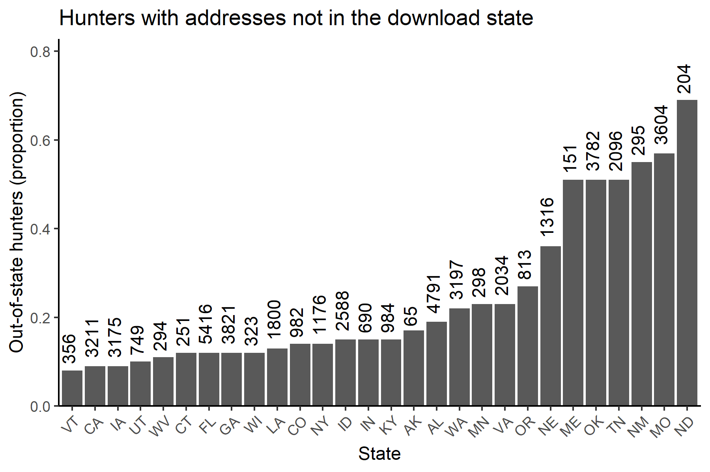

```
## # A tibble: 30 x 3
##    dl_state n_total outofstate_prop
##    <chr>      <int>           <dbl>
##  1 AK           106            0.41
##  2 AL          7025            0.15
##  3 AR          6567            0.65
##  4 CA          3998            0.06
##  5 CO          1747            0.09
##  6 CT           110            0.1 
##  7 FL          3649            0.09
##  8 GA          3584            0.12
##  9 IA          3234            0.05
## 10 ID          1865            0.22
## # ... with 20 more rows
```

### youthHunters

The `youthHunters` function returns a table and plot of the number of hunters with birth dates < 16 years from the year of HIP data collection. These data are interesting to explore because hunters younger than 16 years of age are not required to have a migratory bird hunting license in the United States.


```r
youthHunters(DL1202_proofed, year = 2020)
```

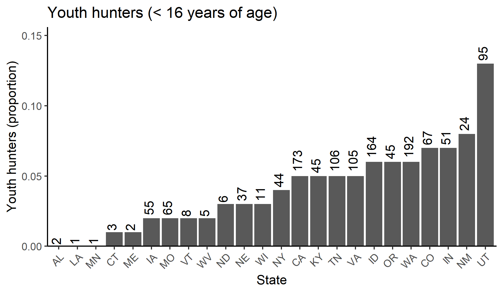

```
## # A tibble: 3 x 4
##   dl_state registered_youth total_registered youth_proportion
##   <chr>               <int>            <int>            <dbl>
## 1 MO                      1             4047         0.000247
## 2 ND                    117              175         0.669   
## 3 NE                      1              547         0.00183
```

### errorPlot_fields

The `errorPlot_fields` function can be run on all states...


```r
errorPlot_fields(DL1202_proofed, loc = "all", year = 2020)
```

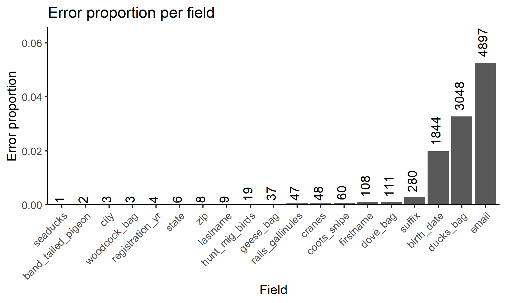

... or it can be limited to just one.


```r
errorPlot_fields(DL1202_proofed, loc = "LA", year = 2020)
```

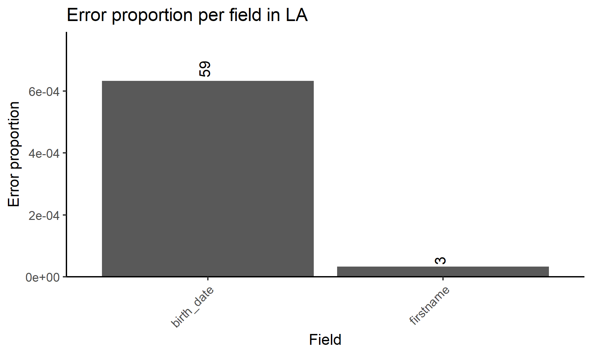

The `youth` parameter can be set to TRUE for `errorPlot_fields` to view the proportion of "errors" created by youth hunters. Youth hunters are not included in the error plot if `youth = FALSE` (set as default).


```r
errorPlot_fields(DL1202_proofed, year = 2020, youth = TRUE)
```

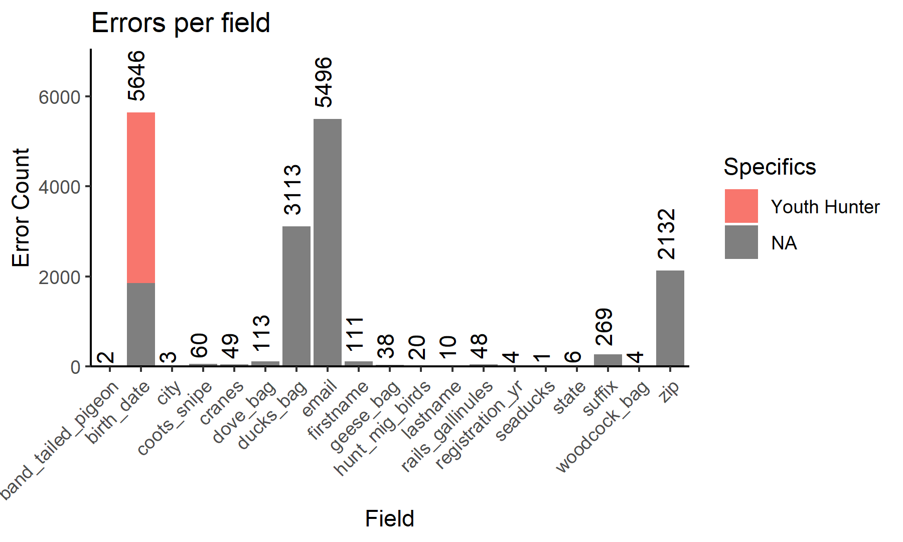

It is possible to add any `ggplot2` components to these plots. For season total data specifically, the plot can be facet_wrapped using either dl_cycle or dl_date. The example below demonstrates how this package's functions can interact with the tidyverse and shows an example of an `errorPlot_fields` facet_wrap (using a subset of 4 download cycles)


```r
errorPlot_fields(
  hipdata2020 %>%
    filter(str_detect(dl_cycle, "0800|0901|0902|1001")),
    year = 2020) +
  theme(
    axis.text.x = element_text(angle = 90, vjust = 0, hjust = 1),
    legend.position = "bottom") +
  facet_wrap(~dl_cycle, ncol = 2)
```

### errorPlot_states

The `errorPlot_states` function plots error proportions per state. You may optionally set a threshold value to only view states above a certain proportion of error. Bar labels are error counts.


```r
errorPlot_states(DL1202_proofed)
```

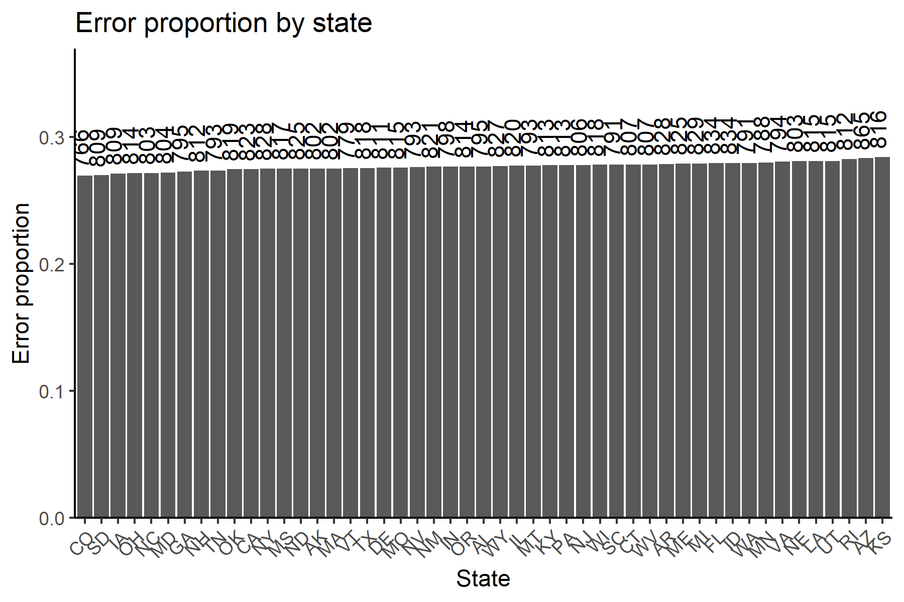

### errorPlot_dl

This function should not be used unless you want to visualize an entire season of data. The `errorPlot_dl` function plots proportion of error per download cycle across the year. Location may be specified to see a particular state over time.


```r
errorPlot_dl(hipdata2020, loc = "MI")
```

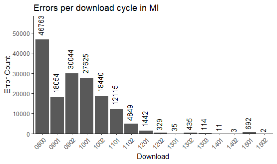

### errorTable

The `errorTable` function is a flexible way to obtain error data as a tibble, which can be assessed as needed or exported to create records of download cycle errors. The basic function reports errors by both location and field.


```r
errorTable(DL1202_proofed)
```

```
## # A tibble: 134 x 3
##    dl_state error      error_count
##    <chr>    <chr>            <dbl>
##  1 AK       birth_date           2
##  2 AK       zip                 32
##  3 AL       birth_date         187
##  4 AL       city                 1
##  5 AL       firstname            7
##  6 AL       lastname             1
##  7 AL       suffix              10
##  8 AL       zip                 25
##  9 AR       birth_date         176
## 10 AR       email                1
## # ... with 124 more rows
```

Errors can be reported by only location by turning off the `field` parameter.


```r
errorTable(DL1202_proofed, field = "none")
```

```
## # A tibble: 30 x 2
##    dl_state error_count
##    <chr>          <dbl>
##  1 AK                34
##  2 AL               231
##  3 AR               726
##  4 CA               464
##  5 CO               193
##  6 CT               116
##  7 FL                53
##  8 GA                57
##  9 IA              3221
## 10 ID               161
## # ... with 20 more rows
```

Errors can be reported by only field by turning off the `loc` parameter.


```r
errorTable(DL1202_proofed, loc = "none")
```

```
## # A tibble: 19 x 2
##    error              error_count
##    <chr>                    <dbl>
##  1 band_tailed_pigeon           2
##  2 birth_date                5634
##  3 city                         3
##  4 coots_snipe                 60
##  5 cranes                      49
##  6 dove_bag                   113
##  7 ducks_bag                 3113
##  8 email                     5489
##  9 firstname                  111
## 10 geese_bag                   38
## 11 hunt_mig_birds              20
## 12 lastname                    10
## 13 rails_gallinules            48
## 14 registration_yr              4
## 15 seaducks                     1
## 16 state                        6
## 17 suffix                     283
## 18 woodcock_bag                 4
## 19 zip                       2132
```

Location can be specified.


```r
errorTable(DL1202_proofed, loc = "CA")
```

```
## # A tibble: 3 x 3
##   dl_state error      error_count
##   <chr>    <chr>            <dbl>
## 1 CA       birth_date         410
## 2 CA       dove_bag            53
## 3 CA       firstname            1
```

Field can be specified.


```r
errorTable(DL1202_proofed, field = "suffix")
```

```
## # A tibble: 1 x 2
##   error  error_count
##   <chr>        <dbl>
## 1 suffix         283
```

Total errors for a location can be pulled.


```r
errorTable(DL1202_proofed, loc = "CA", field = "none")
```

```
## # A tibble: 1 x 2
##   dl_state total_errors
##   <chr>           <dbl>
## 1 CA                464
```

Total errors for a field in a particular location can be pulled.


```r
errorTable(DL1202_proofed, loc = "CA", field = "dove_bag")
```

```
## # A tibble: 1 x 3
##   dl_state error    error_count
##   <chr>    <chr>          <dbl>
## 1 CA       dove_bag          53
```

### redFlags

<b>By state.</b>
States with an unacceptable level of error can be pulled into a tibble. The tibble contains information pertaining to state, the count of errors from that state, the number of correct records from that state, the proportion of error per state, and a "flag" column that prints the threshold used. Any threshold can be supplied; in this example, we see which states had more than 3% error.


```r
redFlags(DL1202_proofed, type = "state", threshold = 0.03)
```

```
## # A tibble: 2 x 5
##   dl_state count_errors count_correct proportion flag        
##   <chr>           <int>         <int>      <dbl> <chr>       
## 1 CT                116          2634     0.0422 error > 0.03
## 2 IA               3221         77629     0.0398 error > 0.03
```

<b>By field.</b>
The same can be done for data fields. In this example, we see which fields had more than 1% error.


```r
redFlags(DL1202_proofed, type = "field", threshold = 0.01)
```

```
## # A tibble: 4 x 5
##   errors     count_errors count_correct proportion flag        
##   <chr>             <int>         <int>      <dbl> <chr>       
## 1 birth_date         5634         87393     0.0606 error > 0.01
## 2 email              5489         87538     0.0590 error > 0.01
## 3 ducks_bag          3113         89914     0.0335 error > 0.01
## 4 zip                2132         90895     0.0229 error > 0.01
```

### hunterSample

After correcting the data, the `hunterSample` function subsets hunters without any errors in their records, ensuring each hunter has a valid mailing address, email address, registration year, and issue date. The function can be run with or without the "random" parameter. If the "random" parameter is used, the specified number of records will be randomly sampled from the corrected data (a non-reproducible event). Without specifying "random", all valid hunters in the data will be returned.


```r
hunterSample(DL1202_corrected, random = 100)
```

## Troubleshooting

### Common read_hip warnings

Sometimes `read_hip` will throw one or more warnings. Warnings are usually benign, but for clarity I provide examples and explanations of common warnings below. If the warning or error you receive after reading HIP data isn't described here and seems like a real problem, please [report an issue](#other).

#### Example 1

This parsing failure occurs when a .txt file is missing the last two columns in the fixed-width file (registration_yr and email). For the offending file(s), these columns are filled with NA in the output tibble. No action must be taken.

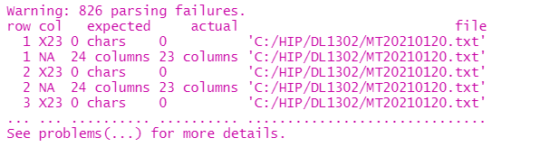

#### Example 2

Another version of a parsing failure occurs when a file is missing the last column in last row of the fixed-width file. This value is set to NA in the output tibble. No action must be taken.

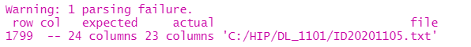

### Memory problems

Some of these functions require a lot of memory to run. To help your R session process these data, especially when working with the large season totals, you can do a few things:

1. Remove objects from the environment. If you have already run `read_hip`, `clean`, and `proof`, you may no longer need your original dataframe or your cleaned dataframe, since most error checking functions work from the proofed or corrected versions of the data. To remove an unneeded object like the cleaned dataframe, run `rm(DL1202_clean)`.

2. Check your memory using `memory.limit()`

3. Increase your memory, e.g. `memory.limit(size = 55000)`

### Other

<b>Issue reporting</b>

If you find a bug in the package, it's advised to [create an issue](https://github.com/USFWS/migbirdHarvestData/issues) at the package's GitHub repo, https://github.com/USFWS/migbirdHarvestData.

<b>Questions?</b>

Contact Abby Walter, abby_walter@fws.gov

